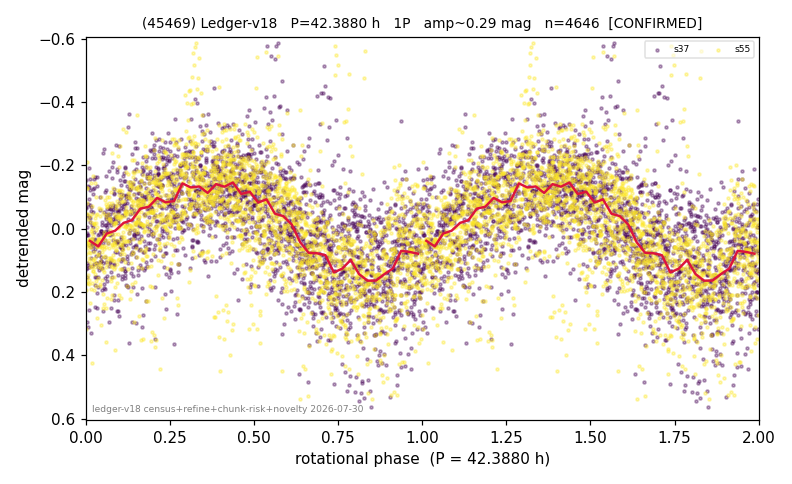

# (45469)

**Adopted:** 42.388 h, 1P, CONFIRMED

<!-- AUTO:START (regenerated from pipeline outputs; do not hand-edit this block) -->
## Evidence (auto)

Detected in 2 sector(s):

| sector | N | baseline (h) | P_phot (h) | power | FAP | cycles | flags |
|--|--|--|--|--|--|--|--|
| s37 | 2283 | 488.3 | 42.1635 | 0.328 | 2.3e-192 | 11.6 | star-cleaned:1,2P-ambiguous |
| s55 | 2421 | 629.3 | 42.6134 | 0.3456 | 3.4e-218 | 14.8 | star-cleaned:28,2P-ambiguous |

- Pipeline refine said: **1P** (folded amp_fourier 0.299); flags: dump-alias-suspect:n=8;gap-alias-risk:76h;sick-dips-excised:s37(7),s55(21)
- DIA (de-comb): survived(dPW=+2%,R2=0.08,s37@42.388h,2sec)
- Coverage: **2 sector(s)**, best sector covers **14.85 cycles** of the adopted period. Measured periodogram peak width 5% of the period, i.e. about **+/- 0.9641 h** (1 sigma); the decimal places in the adopted value are not a precision claim.
- Factor of two: no doubling was applied.
- Gates: FAP<1e-3 and power>=0.10 per detecting sector; >=2 sectors agree (harmonic-aware).
- Adopted shape: **1P** (folded-amplitude rule; pipeline agrees).

### Why this row reads the way it does

- 2 sector(s) detecting
- cross-sector fold correlation 0.95
- single-peaked at folded amp 0.299 mag
- pipeline flag: dump-alias-suspect

<!-- AUTO:END -->
