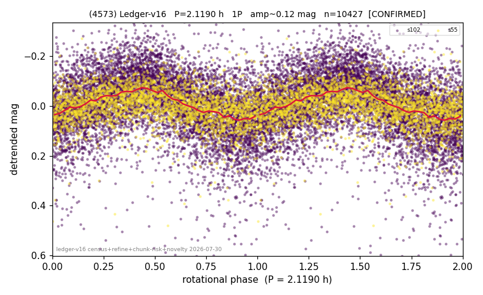

# (4573)

**Adopted:** 4.238 h, 2P, CONFIRMED

<!-- AUTO:START (regenerated from pipeline outputs; do not hand-edit this block) -->
## Evidence (auto)

Detected in 2 sector(s):

| sector | N | baseline (h) | P_phot (h) | power | FAP | cycles | flags |
|--|--|--|--|--|--|--|--|
| s55 | 2803 | 627.7 | 2.1195 | 0.1335 | 7.6e-83 | 296.1 | star-cleaned:37 |
| s102 | 7648 | 578.4 | 2.1185 | 0.1728 | 5.7e-310 | 273.0 | star-cleaned:79,2P-ambiguous |

- Pipeline refine said: **1P** (folded amp_fourier 0.144); flags: sick-dips-excised:s102(18),s55(2)
- DIA (de-comb): not triggered (clean, fast, non-comb)
- Gates: FAP<1e-3 and power>=0.10 per detecting sector; >=2 sectors agree (harmonic-aware).
- **Adopted shape 2P OVERRIDES the pipeline's 1P** (doubling audit 2026-07-25: folded amplitude >= 0.25 mag, so a single-peaked curve is physically implausible; Harris convention -> 2P. The census 3-test doubling logic was measured at only 30% recall against 289 LCDB U>=2 ground-truth periods).

### Why this row reads the way it does

- 2 sector(s) detecting
- cross-sector fold correlation 0.89
- single-peaked at folded amp 0.144 mag
- CORRECTED 2.119->4.2380 h (2026-08-01 sub-barrier sweep): all 49 catalog periods below 2.2 h sat on 5-16 km bodies, impossible as true rotations; doubling MEASURED in the 2026-08-01 fast-rotator re-audit: odd-harmonic 0.86 sigma (1/2 sectors), minima z=2.16

<!-- AUTO:END -->
