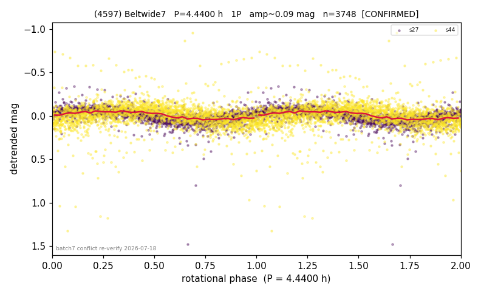

# (4597)

**Adopted:** 4.44 h, 1P, CONFIRMED

<!-- AUTO:START (regenerated from pipeline outputs; do not hand-edit this block) -->
## Evidence (auto)

Detected in 2 sector(s):

| sector | N | baseline (h) | P_phot (h) | power | FAP | cycles | flags |
|--|--|--|--|--|--|--|--|
| s27 | 1584 | 363.7 | 4.4365 | 0.3749 | 4.3e-157 | 41.0 | clean |
| s44 | 2164 | 580.5 | 4.4381 | 0.0921 | 2.3e-41 | 130.8 | star-cleaned:20 |

- Refined shape: **1P** (folded amp_fourier 0.178); flags: sick-dips-excised:s27(1)
- DIA (de-comb): survived(dPW=+4%,R2=0.47,s27@4.436h,1sec)
- Gates: FAP<1e-3 and power>=0.10 per detecting sector; >=2 sectors agree (harmonic-aware); folded-amplitude rule -> 1P.

<!-- AUTO:END -->

## Reasoning
2 sectors agree 4.44 h; the competing 8.873 h/2P entry was a doubling artifact (folded amp 0.11-0.16 < 0.40, no asymmetry). Duplicate rows deduped + resolved.
## Verdict
CONFIRMED 1P / 4.44 h.
