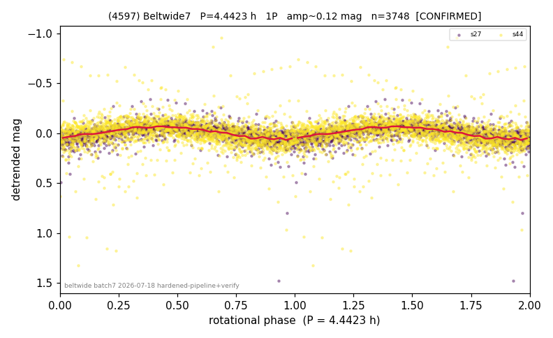

# (4597)

**Adopted:** 4.44 h, 1P, CONFIRMED

<!-- AUTO:START (regenerated from pipeline outputs; do not hand-edit this block) -->
## Evidence (auto)

Detected in 2 sector(s):

| sector | N | baseline (h) | P_phot (h) | power | FAP | cycles | flags |
|--|--|--|--|--|--|--|--|
| s27 | 1584 | 363.7 | 4.4365 | 0.3749 | 4.3e-157 | 41.0 | clean |
| s44 | 2164 | 580.5 | 4.4381 | 0.0921 | 2.3e-41 | 130.8 | star-cleaned:20 |

- Pipeline refine said: **1P** (folded amp_fourier 0.178); flags: sick-dips-excised:s27(1)
- DIA (de-comb): survived_v2(ret=0.998[1.00-1.00],s27@4.436h)
- Coverage: **2 sector(s)**, best sector covers **130.75 cycles** of the adopted period. Measured periodogram peak width 1% of the period, i.e. about **+/- 0.01683 h** (1 sigma); the decimal places in the adopted value are not a precision claim.
- Factor of two: no doubling was applied.
- Gates: FAP<1e-3 and power>=0.10 per detecting sector; >=2 sectors agree (harmonic-aware).
- Adopted shape: **1P** (folded-amplitude rule; pipeline agrees).

### Why this row reads the way it does

- batch7 conflict re-verify 2026-07-18: 2 sectors agree 4.44h (s27 FAP 4e-157; s44 matches to 0.04%); 8.873h was doubling artifact (folded amp 0.11-0.16<0.40, no minima asymmetry); not a comb alias. 1P CONFIRMED

<!-- AUTO:END -->

## Reasoning
2 sectors agree 4.44 h; the competing 8.873 h/2P entry was a doubling artifact (folded amp 0.11-0.16 < 0.40, no asymmetry). Duplicate rows deduped + resolved.
## Verdict
CONFIRMED 1P / 4.44 h.
