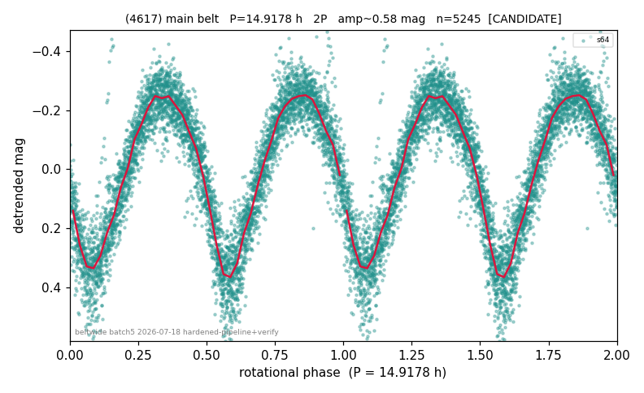

# (4617)

**Adopted:** 14.9178 h, 2P, CANDIDATE

<!-- AUTO:START (regenerated from pipeline outputs; do not hand-edit this block) -->
## Evidence (auto)

Detected in 1 sector(s):

| sector | N | baseline (h) | P_phot (h) | power | FAP | cycles | flags |
|--|--|--|--|--|--|--|--|
| s64 | 5255 | 384.7 | 7.4589 | 0.8433 | 0.0e+00 | 51.6 | 2P-ambiguous |

- Refined shape: **2P** (folded amp_fourier 0.599); flags: sick-dips-excised:s64(6)
- DIA (de-comb): survived(dPW=+0%,R2=0.00,s64@7.459h,2sec)
- Gates: FAP<1e-3 and power>=0.10 per detecting sector; single strong sector (candidate ceiling); folded-amplitude rule -> 2P.

<!-- AUTO:END -->
