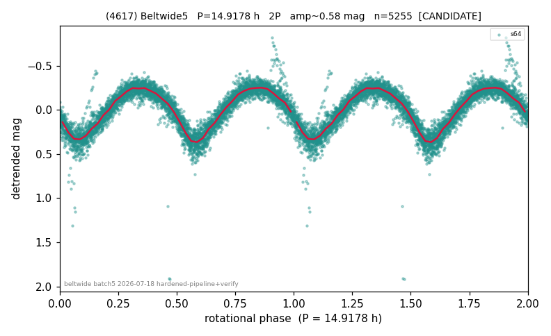

# (4617)

**Adopted:** 14.9178 h, 2P, CANDIDATE

<!-- AUTO:START (regenerated from pipeline outputs; do not hand-edit this block) -->
## Evidence (auto)

Detected in 2 sector(s):

| sector | N | baseline (h) | P_phot (h) | power | FAP | cycles | flags |
|--|--|--|--|--|--|--|--|
| s64 | 5255 | 384.7 | 7.4589 | 0.8433 | 0.0e+00 | 51.6 | 2P-ambiguous |
| s80 | 4012 | 361.8 | 12.627 | 0.0294 | 6.7e-22 | 28.7 | star-cleaned:137 |

- Pipeline refine said: **2P** (folded amp_fourier 0.599); flags: sick-dips-excised:s64(6)
- DIA (de-comb): survived(dPW=+0%,R2=0.00,s64@7.459h,2sec)
- Coverage: **1 sector(s)**, best sector covers **25.79 cycles** of the adopted period. Measured periodogram peak width 2% of the period, i.e. about **+/- 0.05655 h** (1 sigma); the decimal places in the adopted value are not a precision claim.
- Factor of two: **adopted on the amplitude convention**: standard practice for an elongated body, but a convention rather than a measurement.
- Gates: FAP<1e-3 and power>=0.10 per detecting sector; single strong sector (candidate ceiling).
- Adopted shape: **2P** (folded-amplitude rule; pipeline agrees).

### Why this row reads the way it does

- Only s64 (single-sector, ceiling=CANDIDATE, ZTF=ERROR no independent confirm). Indep LS: P_base=7.4591h, power=0.803, FAP~0. PDM confirms: 7.458h (the
- 2P by amplitude rule (folded_amp=0.599)

<!-- AUTO:END -->
