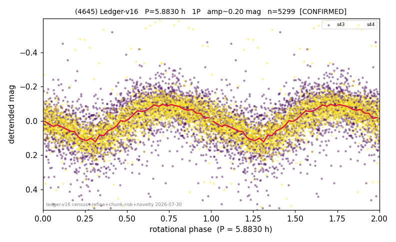

# (4645)

**Adopted:** 11.766 h, 2P, CONFIRMED

<!-- AUTO:START (regenerated from pipeline outputs; do not hand-edit this block) -->
## Evidence (auto)

Detected in 3 sector(s):

| sector | N | baseline (h) | P_phot (h) | power | FAP | cycles | flags |
|--|--|--|--|--|--|--|--|
| s43 | 2695 | 593.2 | 5.8824 | 0.2496 | 2.2e-163 | 50.4 | star-cleaned:21 |
| s44 | 2633 | 568.8 | 5.883 | 0.35 | 1.7e-241 | 96.7 | star-cleaned:16,2P-ambiguous |
| s80 | 2268 | 303.2 | 5.8813 | 0.0384 | 2.0e-15 | 51.5 | star-cleaned:79 |

- Pipeline refine said: **1P** (folded amp_fourier 0.275); flags: sick-dips-excised:s43(4),s44(7)
- DIA (de-comb): inconclusive(dPW=+21%,R2=0.46,s44@5.883h)
- Coverage: **2 sector(s)**, best sector covers **50.42 cycles** of the adopted period. Measured periodogram peak width 1% of the period, i.e. about **+/- 0.02099 h** (1 sigma); the decimal places in the adopted value are not a precision claim.
- Factor of two: **measured on the data** (odd-harmonic power or unequal minima, significant and reproduced), METHODOLOGY 3b.
- Gates: FAP<1e-3 and power>=0.10 per detecting sector; >=2 sectors agree (harmonic-aware).
- **Adopted shape 2P OVERRIDES the pipeline's 1P** (doubling audit 2026-07-25: folded amplitude >= 0.25 mag, so a single-peaked curve is physically implausible; Harris convention -> 2P. The census 3-test doubling logic was measured at only 30% recall against 289 LCDB U>=2 ground-truth periods).

### Why this row reads the way it does

- 2 sector(s) detecting
- cross-sector fold correlation 0.96
- single-peaked at folded amp 0.275 mag
- CORRECTED 5.883->11.7660 h (2026-08-02 full 1P re-audit): doubling MEASURED at odd-harmonic 12.4 sigma with ALL detecting sectors significant (2/2); threshold odd>=8+full-reproduction calibrated to 0/60 false fires on the 4P null test (the minima-asymmetry branch alone fired falsely at z up to 34 and is not accepted)

<!-- AUTO:END -->
