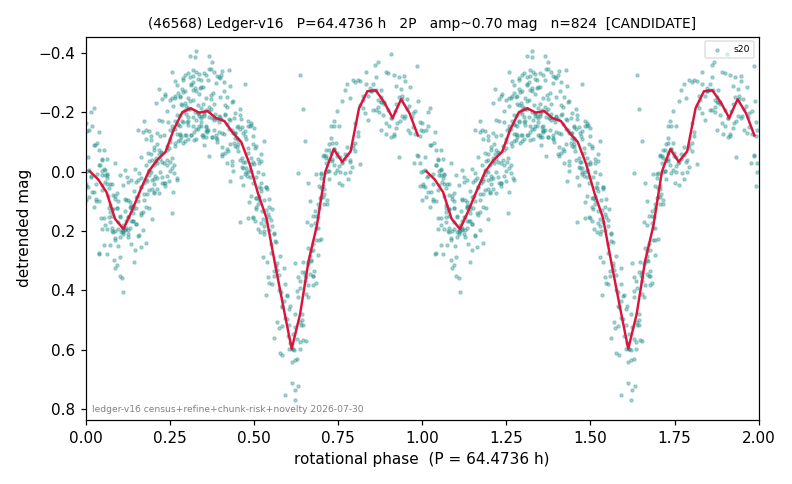

# (46568)

**Adopted:** 64.4736 h, 2P, CANDIDATE

<!-- AUTO:START (regenerated from pipeline outputs; do not hand-edit this block) -->
## Evidence (auto)

Detected in 1 sector(s):

| sector | N | baseline (h) | P_phot (h) | power | FAP | cycles | flags |
|--|--|--|--|--|--|--|--|
| s20 | 824 | 536.0 | 32.2368 | 0.6086 | 3.3e-163 | 8.3 | clean |

- Pipeline refine said: **2P** (folded amp_fourier 0.648); flags: near-comb(amp-cleared):n=5,10
- DIA (de-comb): survived(dPW=+10%,R2=0.05,s20@32.237h,3sec)
- Coverage: **1 sector(s)**, best sector covers **8.31 cycles** of the adopted period. Measured periodogram peak width 5% of the period, i.e. about **+/- 0.6829 h** (1 sigma); the decimal places in the adopted value are not a precision claim.
- Factor of two: **adopted on the amplitude convention**: standard practice for an elongated body, but a convention rather than a measurement.
- Gates: FAP<1e-3 and power>=0.10 per detecting sector; single strong sector (candidate ceiling).
- Adopted shape: **2P** (folded-amplitude rule; pipeline agrees).

### Why this row reads the way it does

- 1 sector(s) detecting
- doubling BY CONVENTION: amplitude rule on folded amp 0.648 mag, not individually audited

<!-- AUTO:END -->
