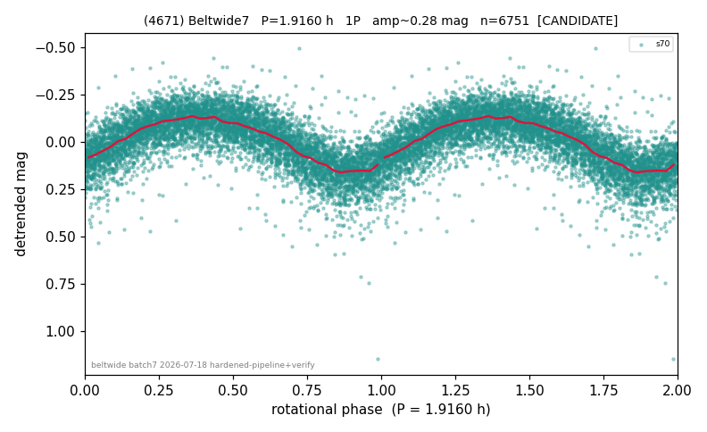

# (4671)

**Adopted:** 3.833 h, 2P, CANDIDATE

<!-- AUTO:START (regenerated from pipeline outputs; do not hand-edit this block) -->
## Evidence (auto)

Detected in 1 sector(s):

| sector | N | baseline (h) | P_phot (h) | power | FAP | cycles | flags |
|--|--|--|--|--|--|--|--|
| s70 | 6751 | 600.9 | 1.916 | 0.5675 | 0.0e+00 | 313.6 | 2P-ambiguous |

- Pipeline refine said: **1P** (folded amp_fourier 0.322); flags: sick-dips-excised:s70(1)
- DIA (de-comb): survived(dPW=-0%,R2=0.02,s70@1.916h,3sec)
- Gates: FAP<1e-3 and power>=0.10 per detecting sector; single strong sector (candidate ceiling).
- **Adopted shape 2P OVERRIDES the pipeline's 1P** (doubling audit 2026-07-25: folded amplitude >= 0.25 mag, so a single-peaked curve is physically implausible; Harris convention -> 2P. The census 3-test doubling logic was measured at only 30% recall against 289 LCDB U>=2 ground-truth periods).

### Why this row reads the way it does

- batch7 conflict re-verify 2026-07-18: single-sector s70; LS 1.916h strong but H=13.03 (D~5-15km) sub-2.2h spin-barrier -> physics-forced 2P/3.833h; CANDIDATE (single-sector cap)

<!-- AUTO:END -->

## Reasoning
Single sector s70; LS 1.916 h strong, H=13.03 (D~5-15 km) sub-barrier -> physics-forced 2P/3.833 h.
## Verdict
CANDIDATE 2P / 3.833 h (single-sector cap).
