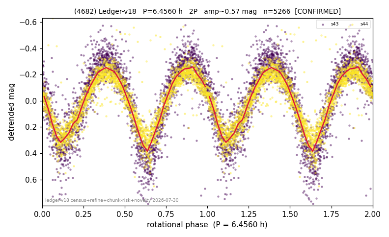

# (4682)

**Adopted:** 6.456 h, 2P, CONFIRMED

<!-- AUTO:START (regenerated from pipeline outputs; do not hand-edit this block) -->
## Evidence (auto)

Detected in 2 sector(s):

| sector | N | baseline (h) | P_phot (h) | power | FAP | cycles | flags |
|--|--|--|--|--|--|--|--|
| s43 | 2520 | 592.2 | 3.2284 | 0.7668 | 0.0e+00 | 183.4 | star-cleaned:6,2P-ambiguous |
| s44 | 2754 | 566.4 | 3.2276 | 0.7621 | 0.0e+00 | 175.5 | star-cleaned:13,2P-ambiguous |

- Pipeline refine said: **2P** (folded amp_fourier 0.738); flags: sick-dips-excised:s43(4),s44(3)
- DIA (de-comb): survived(dPW=+4%,R2=0.26,s43@3.228h,3sec)
- Gates: FAP<1e-3 and power>=0.10 per detecting sector; >=2 sectors agree (harmonic-aware).
- Adopted shape: **2P** (folded-amplitude rule; pipeline agrees).

### Why this row reads the way it does

- 2 sector(s) detecting
- cross-sector fold correlation 0.99
- doubling BY CONVENTION: amplitude rule on folded amp 0.738 mag, not individually audited

<!-- AUTO:END -->
