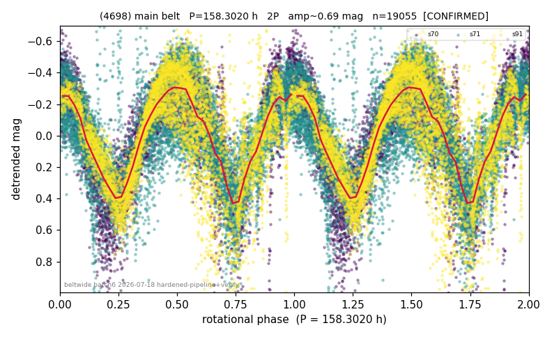

# (4698)

**Adopted:** 158.302 h, 2P, CONFIRMED

<!-- AUTO:START (regenerated from pipeline outputs; do not hand-edit this block) -->
## Evidence (auto)

Detected in 3 sector(s):

| sector | N | baseline (h) | P_phot (h) | power | FAP | cycles | flags |
|--|--|--|--|--|--|--|--|
| s70 | 5014 | 288.2 | 79.1431 | 0.6059 | 0.0e+00 | 3.6 | 2P-untestable,2P-ambiguous |
| s71 | 7696 | 474.2 | 79.151 | 0.4655 | 0.0e+00 | 3.0 | star-cleaned:15 |
| s91 | 6542 | 556.1 | 79.9906 | 0.5156 | 0.0e+00 | 3.5 | star-cleaned:14 |

- Refined shape: **2P** (folded amp_fourier 0.753); flags: few-cycle:1.8;sector-dropped:s71,s91(range>3mag);sick-dips-excised:s70(20)
- DIA (de-comb): survived(dPW=+10%,R2=0.10,s70@79.151h,4sec)
- Gates: FAP<1e-3 and power>=0.10 per detecting sector; >=2 sectors agree (harmonic-aware); folded-amplitude rule -> 2P.

<!-- AUTO:END -->
