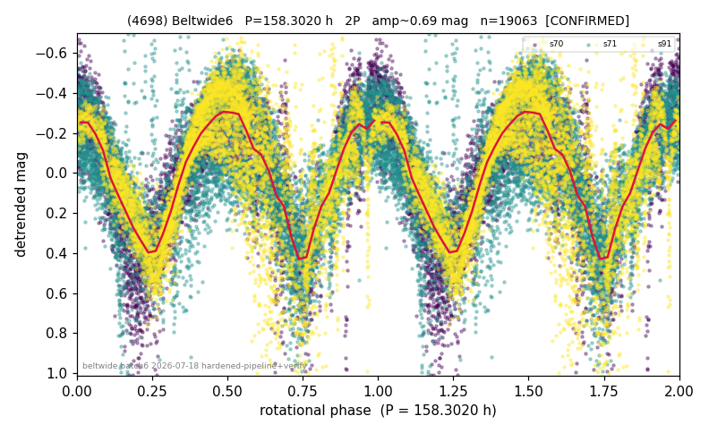

# (4698)

**Adopted:** 158.302 h, 2P, CONFIRMED

<!-- AUTO:START (regenerated from pipeline outputs; do not hand-edit this block) -->
## Evidence (auto)

Detected in 3 sector(s):

| sector | N | baseline (h) | P_phot (h) | power | FAP | cycles | flags |
|--|--|--|--|--|--|--|--|
| s70 | 5014 | 288.2 | 79.1431 | 0.6059 | 0.0e+00 | 3.6 | 2P-untestable,2P-ambiguous |
| s71 | 7696 | 474.2 | 79.151 | 0.4655 | 0.0e+00 | 3.0 | star-cleaned:15 |
| s91 | 6542 | 556.1 | 79.9906 | 0.5156 | 0.0e+00 | 3.5 | star-cleaned:14 |

- Pipeline refine said: **2P** (folded amp_fourier 0.753); flags: few-cycle:3.5;gap-alias-risk:101h;sick-dips-excised:s70(20),s71(48),s91(121)
- DIA (de-comb): survived_v2(ret=0.930[0.70-1.00],s70@79.151h)
- Coverage: **3 sector(s)**, best sector covers **3.51 cycles** of the adopted period. Measured periodogram peak width 13% of the period, i.e. about **+/- 4.501 h** (1 sigma); the decimal places in the adopted value are not a precision claim.
- Factor of two: **adopted on the amplitude convention**: standard practice for an elongated body, but a convention rather than a measurement.
- Gates: FAP<1e-3 and power>=0.10 per detecting sector; >=2 sectors agree (harmonic-aware).
- Adopted shape: **2P** (folded-amplitude rule; pipeline agrees).

### Why this row reads the way it does

- REVIEW-FLAG: folded_amp=0.7. All 3 sectors independently find the same fundamental P≈79.14-79.99h (spread &lt;1.1%, well within harmonic tolerance) despite s71/s91 being flagged sector-dropped(range&gt;3mag); removing faint-side contaminat

<!-- AUTO:END -->
