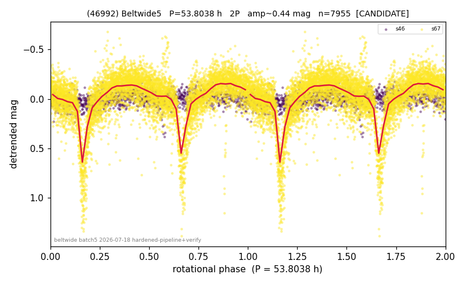

# (46992)

**Adopted:** 53.8038 h, 2P, CANDIDATE

<!-- AUTO:START (regenerated from pipeline outputs; do not hand-edit this block) -->
## Evidence (auto)

Detected in 2 sector(s):

| sector | N | baseline (h) | P_phot (h) | power | FAP | cycles | flags |
|--|--|--|--|--|--|--|--|
| s46 | 1145 | 211.4 | 26.9368 | 0.0729 | 3.4e-15 | 7.8 | clean |
| s67 | 6828 | 584.6 | 26.9019 | 0.353 | 0.0e+00 | 21.7 | star-cleaned:78,2P-ambiguous |

- Refined shape: **2P** (folded amp_fourier 0.436); flags: near-comb(amp-cleared):n=6,12;sick-dips-excised:s67(18);near-threshold:0.44
- DIA (de-comb): survived(dPW=+1%,R2=0.01,s67@26.902h,4sec)
- Gates: FAP<1e-3 and power>=0.10 per detecting sector; single strong sector (candidate ceiling); folded-amplitude rule -> 2P.

<!-- AUTO:END -->

## Mutual-event candidate (2026-07-19, unconfirmed, reported)
Manual review of the published fold flagged a deep dip; forensics show it is a train
of deep (0.8-1.3 mag), narrow (3-4 h, 5-7% of the period), V-shaped minima recurring
every ~26.9 h (= half the 53.80 h period) at two fixed phases half a cycle apart,
phase-locked across all ~11 cycles of s67 with healthy errors. No stationary point;
same-star recrossing excluded; s46 (different apparition) shows no events, consistent
with aspect-dependent mutual-event visibility. These properties match an eclipsing,
plausibly doubly synchronous binary with system period 53.8 h, the same class as
854 Frostia and 4492 Debussy. UNCONFIRMED: needs a second epoch or one ground-based
event. The adopted 53.8038 h stands as the photometric system period either way.
Full evidence: RESULTS_46992_BINARY_CANDIDATE.md (working dir).
