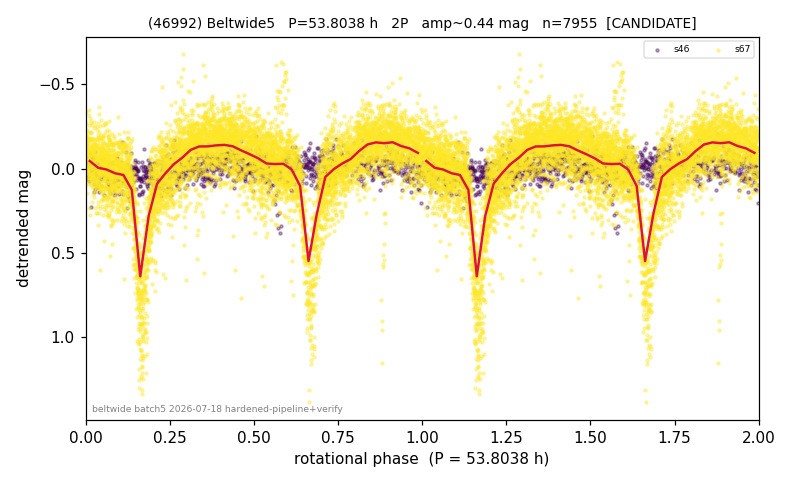

# (46992)

**Adopted:** 53.8038 h, 2P, CANDIDATE

<!-- AUTO:START (regenerated from pipeline outputs; do not hand-edit this block) -->
## Evidence (auto)

Detected in 2 sector(s):

| sector | N | baseline (h) | P_phot (h) | power | FAP | cycles | flags |
|--|--|--|--|--|--|--|--|
| s46 | 1145 | 211.4 | 26.9368 | 0.0729 | 3.4e-15 | 7.8 | clean |
| s67 | 6828 | 584.6 | 26.9019 | 0.353 | 0.0e+00 | 21.7 | star-cleaned:78,2P-ambiguous |

- Pipeline refine said: **2P** (folded amp_fourier 0.436); flags: near-comb(amp-cleared):n=6,12;sick-dips-excised:s67(18);near-threshold:0.44
- DIA (de-comb): survived_v2(ret=0.997[1.00-1.00],s67@26.902h)
- Coverage: **2 sector(s)**, best sector covers **10.87 cycles** of the adopted period. Measured periodogram peak width 4% of the period, i.e. about **+/- 0.4319 h** (1 sigma); the decimal places in the adopted value are not a precision claim.
- Factor of two: **measured on the data** (odd-harmonic power or unequal minima, significant and reproduced), METHODOLOGY 3b.
- Gates: FAP<1e-3 and power>=0.10 per detecting sector; single strong sector (candidate ceiling).
- Adopted shape: **2P** (folded-amplitude rule; pipeline agrees).

### Why this row reads the way it does

- s67(n=6828,pw=0.353,FAP~0)+PDM agree P=26.90h; s46 below power floor(0.073<0.10)->only 1 real detection. Folded amp at s67 fundamental=0.535>0.40 -> e
- candidate synchronous eclipsing binary: flat baseline + narrow 0.6-1.6 mag eclipses at phases 0.17/0.67 (sep 0.502), events photon-consistent, absent in s46 (eclipse season off); 53.804 h likely ORBITAL; see objects/46992.md
- doubling MEASURED: two distinct minima at phases separated by 0.502, the eclipse morphology that breaks the P/2 degeneracy; amplitude rule concurs (folded_amp=0.436); 53.804 h reads as the system period per the binary-candidate note

<!-- AUTO:END -->

## Mutual-event candidate (2026-07-19, unconfirmed, reported)
Manual review of the published fold flagged a deep dip; forensics show it is a train
of deep (0.8-1.3 mag), narrow (3-4 h, 5-7% of the period), V-shaped minima recurring
every ~26.9 h (= half the 53.80 h period) at two fixed phases half a cycle apart,
phase-locked across all ~11 cycles of s67 with healthy errors. No stationary point;
same-star recrossing excluded; s46 (different apparition) shows no events, consistent
with aspect-dependent mutual-event visibility. These properties match an eclipsing,
plausibly doubly synchronous binary with system period 53.8 h, the same class as
854 Frostia and 4492 Debussy. UNCONFIRMED: needs a second epoch or one ground-based
event. The adopted 53.8038 h stands as the photometric system period either way.
Full evidence: RESULTS_46992_BINARY_CANDIDATE.md (working dir).

## Candidate synchronous eclipsing binary (2026-08-01)

The adopted 53.804 h entry is best read as the ORBITAL period of a candidate eclipsing
binary, not as an ordinary rotation:

- The out-of-eclipse baseline is FLAT, interrupted by narrow deep minima (0.6-1.6 mag,
  0.6-2.7 h) at two phases separated by 0.502 of the cycle -- primary and secondary events
  half an orbit apart. An elongated single body produces a smooth double sinusoid, not a
  flat curve with notches; this morphology is what breaks the usual P/2 degeneracy.
- 17 of 20 events in s67 pass the photon-statistics test (in-event errors grow as
  10^(0.2*depth), as a real flux drop requires; only 2 are artefacts).
- Event arrivals repeat at 26.88 h = P/2 with clean spacing, and the events are ABSENT in
  s46 (visited ~1.5 yr earlier), which is expected: mutual events are only visible near the
  mutual-orbit equinox and switch off between epochs.
- Survived the field-wide common-mode veto built from ~3,200 curves (the same veto that
  eliminated every other candidate of the 2026-07-30 binary survey).
- Independent visual identification during the 2026-08-01 human review of the catalog
  montage, before the reviewer knew the survey result.
- Survived two instrumental tests added on 2026-08-03 after they killed an unrelated dip
  claim: the events are not locked to data-gap edges (p = 0.11 against uniform placement in
  the same cadences) and do not cluster at any phase of the 328.8 h spacecraft orbit
  (p = 0.86). Six of the 17 events do sit within 0.7 h of a gap edge, which the test finds
  consistent with this object's gap structure, but it is stated rather than buried.
- Survived the rotational-phase test added the same day, which is the one that matters here.
  Folded at the rotation period the events show concentration R = 0.055, i.e. they are NOT a
  single feature of the rotation curve; folded at half the period, R = 0.917. Nine of the 38
  periodic objects in the expanded survey fail this test, including the object that came out
  of it with the strongest formal significance, (761), whose 28 "events" were one narrow
  minimum at rotational phase 0.97 counted once per cycle.

**Formal significance, corrected 2026-08-03 (read this before quoting a p-value).** The
survey was extended from 528 to 2,210 objects, of which 806 had enough events to test. The
Bonferroni bar therefore tightened from 0.05/209 to 0.05/806 = 6.2e-5, and this object's
p = 2.1e-4 now sits above it: it is no longer "survey-significant" under the strict
correction. The evidence did not change, the multiple-testing accounting did, and the honest
statement of both is: at p = 2.1e-4 over 806 tests the expected number of chance objects this
extreme is 0.17, so it remains the leading candidate of the survey, on morphology rather than
on formal significance.

Not established: ZTF has no coverage within +-180 d of the s67 event season, and the object
is in solar conjunction until late 2027, so no independent instrument has seen the events
yet. Ground follow-up at the next apparition (V~16-17, events reachable with mid-size
amateur instruments over two consecutive nights given the 26.88 h spacing) would settle it.
Analysis files: docs/results (binary survey), dips_46992 diagnostic figure.

## Season close (2026-08-24): what the 2023 apparition can and cannot say

- **Ephemeris (two-stage fit, per-event trapezoids + marginalised hierarchy):**
  P_event 26.8838 h +/- 1.9 min, O-C rms 16 min over 19-21 events, no cycle slips.
- **Twin-component constraint:** profiling the primary/secondary depth asymmetry gives
  best fit Delta = 0 and a 95 per cent limit **Delta <= 0.197** (0.233 on the 14 complete
  events). The data do not merely fail to show alternation, they exclude it beyond ~20
  per cent: if the system orbits at 2P, the components are near-twins (Frostia class).
  TESS alone therefore cannot distinguish P_orb = 26.88 h from 53.77 h.
- **Instrumental check:** the eclipse signal is untouched by the v2 systematics screen
  (retained amplitude 1.02 [1.01-1.05] at 26.88 h; per-event depths unchanged after
  projection).
- **Ground-based archives (ATLAS forced photometry + MPC epochs, same underlying
  dataset):** directionally consistent with dimming at the TESS-predicted eclipse
  phases (in-phase flux ratio 0.942, deepest points 27-30 per cent at predicted
  centres), but the nominally strong epoch-based signal does not survive
  station-stratified and fake-T0 calibration. Verdict: **supports, does not
  independently confirm**.
- **Forward look:** with sigma_P ~ 1.9 min the phase uncertainty reaches ~46 h by the
  late-2027 apparition, so the TESS-only ephemeris predicts the season, not individual
  events. A dedicated >27 h campaign at the next favourable apparition (or Gaia DR4
  epochs) is the decisive test.
