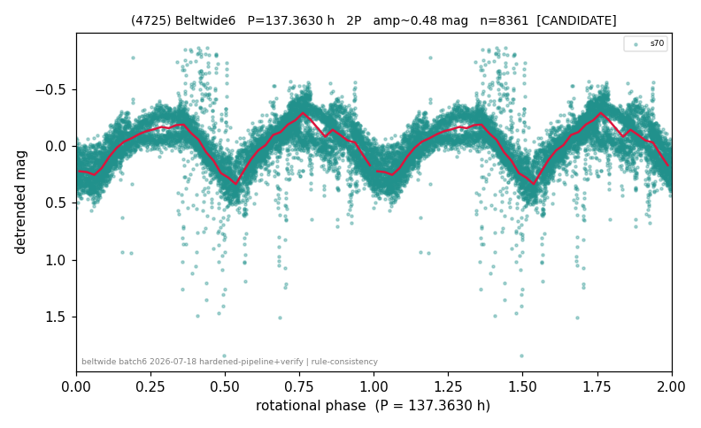

# (4725)

**Adopted:** 137.363 h, 2P, CANDIDATE

<!-- AUTO:START (regenerated from pipeline outputs; do not hand-edit this block) -->
## Evidence (auto)

Detected in 1 sector(s):

| sector | N | baseline (h) | P_phot (h) | power | FAP | cycles | flags |
|--|--|--|--|--|--|--|--|
| s70 | 8361 | 600.9 | 68.6815 | 0.5849 | 0.0e+00 | 8.7 | star-cleaned:61,2P-ambiguous |

- Refined shape: **2P** (folded amp_fourier 0.449); flags: sick-dips-excised:s70(38);near-threshold:0.45
- DIA (de-comb): survived(dPW=+3%,R2=0.01,s70@68.681h,2sec)
- Gates: FAP<1e-3 and power>=0.10 per detecting sector; single strong sector (candidate ceiling); folded-amplitude rule -> 2P.

<!-- AUTO:END -->
