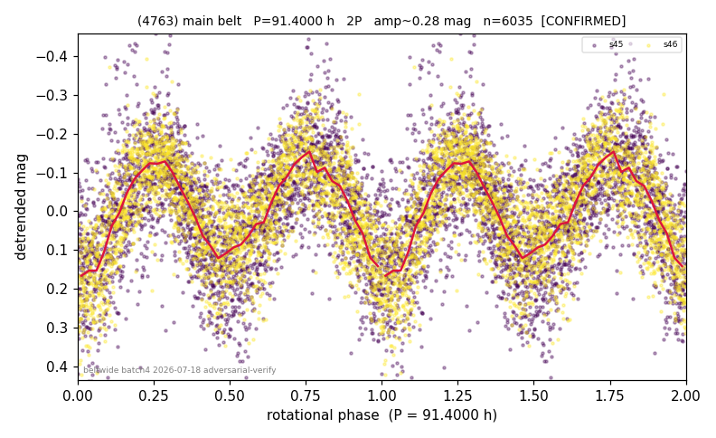

# (4763)

**Adopted:** 91.4 h, 2P, CONFIRMED

<!-- AUTO:START (regenerated from pipeline outputs; do not hand-edit this block) -->
## Evidence (auto)

Detected in 2 sector(s):

| sector | N | baseline (h) | P_phot (h) | power | FAP | cycles | flags |
|--|--|--|--|--|--|--|--|
| s45 | 3288 | 585.1 | 45.8023 | 0.3611 | 7.2e-315 | 12.8 | star-cleaned:1,2P-ambiguous |
| s46 | 2776 | 614.7 | 45.6616 | 0.5325 | 0.0e+00 | 13.5 | star-cleaned:63,2P-ambiguous |

- Pipeline refine said: **1P** (folded amp_fourier 0.298); flags: dump-alias-suspect:n=7;sick-dips-excised:s45(3),s46(1)
- DIA (de-comb): inconclusive(dPW=+19%,R2=0.25,s46@45.732h)
- Gates: FAP<1e-3 and power>=0.10 per detecting sector; >=2 sectors agree (harmonic-aware).
- **Adopted shape 2P OVERRIDES the pipeline's 1P** (doubling audit 2026-07-25: folded amplitude >= 0.25 mag, so a single-peaked curve is physically implausible; Harris convention -> 2P. The census 3-test doubling logic was measured at only 30% recall against 289 LCDB U>=2 ground-truth periods).

### Why this row reads the way it does

- Both sectors independently recover the same period with error-weighted LS and PDM (S45 LS=45.80h, pow=0.36, FAP~7e-315; S46 LS=45.66h, pow=0.53, FAP~0; P doubled 2026-07-25 (doubling audit: amp>=0.25 + Harris convention)

<!-- AUTO:END -->
