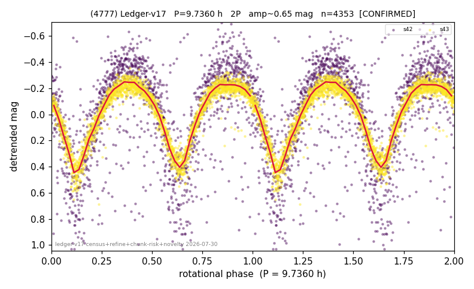

# (4777)

**Adopted:** 9.736 h, 2P, CONFIRMED

<!-- AUTO:START (regenerated from pipeline outputs; do not hand-edit this block) -->
## Evidence (auto)

Detected in 2 sector(s):

| sector | N | baseline (h) | P_phot (h) | power | FAP | cycles | flags |
|--|--|--|--|--|--|--|--|
| s42 | 1589 | 338.7 | 4.8681 | 0.5426 | 4.2e-265 | 69.6 | star-cleaned:11,2P-ambiguous |
| s43 | 2817 | 590.0 | 4.8681 | 0.8374 | 0.0e+00 | 121.2 | star-cleaned:6,2P-ambiguous |

- Pipeline refine said: **2P** (folded amp_fourier 0.773); flags: sick-dips-excised:s42(32),s43(3)
- DIA (de-comb): survived(dPW=+6%,R2=0.41,s43@4.868h,4sec)
- Gates: FAP<1e-3 and power>=0.10 per detecting sector; >=2 sectors agree (harmonic-aware).
- Adopted shape: **2P** (folded-amplitude rule; pipeline agrees).

### Why this row reads the way it does

- 2 sector(s) detecting
- cross-sector fold correlation 0.99
- doubling BY CONVENTION: amplitude rule on folded amp 0.773 mag, not individually audited

<!-- AUTO:END -->
