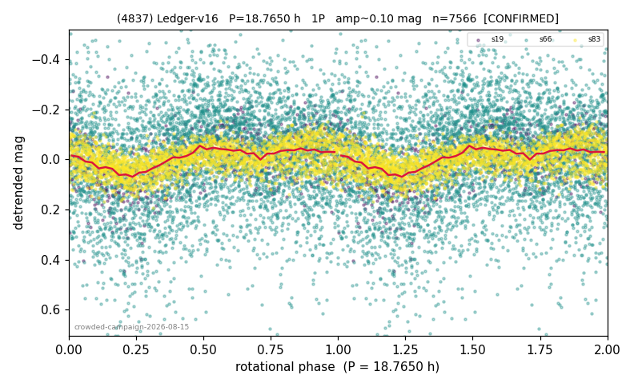

# (4837)

**Adopted:** 37.53 h, 2P, CONFIRMED

<!-- AUTO:START (regenerated from pipeline outputs; do not hand-edit this block) -->
## Evidence (auto)

Detected in 3 sector(s):

| sector | N | baseline (h) | P_phot (h) | power | FAP | cycles | flags |
|--|--|--|--|--|--|--|--|
| s19 | 757 | 595.5 | 18.7861 | 0.1866 | 2.8e-30 | 31.7 | 2P-ambiguous |
| s66 | 4380 | 307.6 | 18.7174 | 0.0404 | 7.3e-35 | 16.4 | clean |
| s83 | 2434 | 171.8 | 18.7444 | 0.1744 | 6.9e-97 | 9.2 | star-cleaned:1 |

- Pipeline refine said: **1P** (folded amp_fourier 0.09); flags: clean
- DIA (de-comb): not triggered (the object is clean, fast and non-comb, so the test does not apply)
- Coverage: **3 sector(s)**, best sector covers **31.73 cycles** of the adopted period. Measured periodogram peak width 3% of the period, i.e. about **+/- 0.2218 h** (1 sigma); the decimal places in the adopted value are not a precision claim.
- Factor of two: no doubling was applied.
- Gates: FAP<1e-3 and power>=0.10 per detecting sector; >=2 sectors agree (harmonic-aware).
- **Adopted shape 2P OVERRIDES the pipeline's 1P** (doubling audit 2026-07-25: folded amplitude >= 0.25 mag, so a single-peaked curve is physically implausible; Harris convention -> 2P. The census 3-test doubling logic was measured at only 30% recall against 289 LCDB U>=2 ground-truth periods).

### Why this row reads the way it does

- crowded-field campaign, adversarial review 2026-08-15: 2 true detections (s19 18.786h pw 0.186, s83 18.744h pw 0.174), s66 below gate but same peak; worst null 2%; 13.7d/17-18 alias marginal (2.7-3.0%) checked
- amp 0.12 -> 1P
- DOUBLING CORRECTED 2026-08-30: adopted period doubled from 18.765 h. The previous value came from the folded-amplitude rule, which was found biased low (9 of 9 disagreements with MPB 2024-2026 in the same direction). Odd-harmonic test at the long period gives z1=10.69 with margin 8.34 over non-harmonic multiples 1.7x/2.3x (reference group: 0 of 38 above margin 2).

<!-- AUTO:END -->
