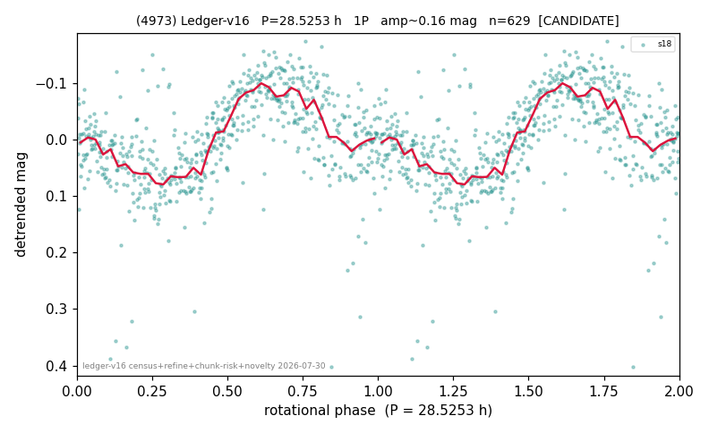

# (4973)

**Adopted:** 28.5253 h, 1P, CONFIRMED

<!-- AUTO:START (regenerated from pipeline outputs; do not hand-edit this block) -->
## Evidence (auto)

Detected in 2 sector(s):

| sector | N | baseline (h) | P_phot (h) | power | FAP | cycles | flags |
|--|--|--|--|--|--|--|--|
| s18 | 629 | 563.5 | 28.5253 | 0.3316 | 3.6e-51 | 19.8 | 2P-ambiguous |
| s66 | 4026 | 334.8 | 28.3544 | 0.0816 | 5.1e-70 | 11.8 | star-cleaned:59 |

- Pipeline refine said: **1P** (folded amp_fourier 0.159); flags: clean
- DIA (de-comb): not triggered (the object is clean, fast and non-comb, so the test does not apply)
- Coverage: **1 sector(s)**, best sector covers **19.75 cycles** of the adopted period. Measured periodogram peak width 4% of the period, i.e. about **+/- 0.5152 h** (1 sigma); the decimal places in the adopted value are not a precision claim.
- Factor of two: no doubling was applied.
- Gates: FAP<1e-3 and power>=0.10 per detecting sector; >=2 sectors agree (harmonic-aware).
- Adopted shape: **1P** (folded-amplitude rule; pipeline agrees).

### Why this row reads the way it does

- 1 sector(s) detecting
- single-peaked at folded amp 0.159 mag
- PROMOTED CANDIDATE->CONFIRMED 2026-08-15 (TESS+ZTF joint, the user-blessed pathway): independent ZTF blind Lomb-Scargle over 6.8 yr / 435 g+r points recovers 28.4391 h = TESS-P 28.5253h to 0.30%, power 0.481, trials-corrected FAP 1.7e-56, beating every alias/comb candidate (alias 13.0339h at 0.408); a ZTF detection cannot be a TESS comb tooth or TESS red noise, so this is a genuine second realization and the single-sector ceiling no longer applies

<!-- AUTO:END -->
