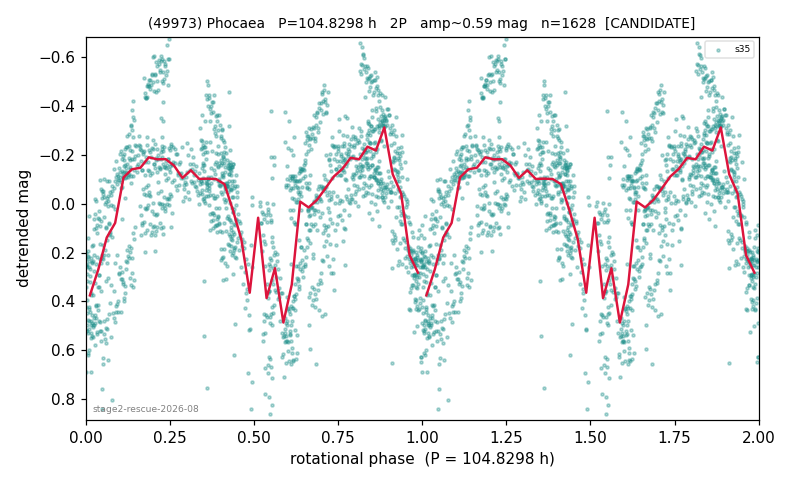

# (49973)

**Adopted:** 104.8298 h, 2P, CANDIDATE

<!-- AUTO:START (regenerated from pipeline outputs; do not hand-edit this block) -->
## Evidence (auto)

Detected in 0 sector(s):

| sector | N | baseline (h) | P_phot (h) | power | FAP | cycles | flags |
|--|--|--|--|--|--|--|--|

- Coverage: **1 sector(s)**, best sector covers **5.64 cycles** of the adopted period. Measured periodogram peak width 6% of the period, i.e. about **+/- 1.414 h** (1 sigma); the decimal places in the adopted value are not a precision claim.
- Factor of two: **not confirmed**; the entry records this explicitly.
- Gates: FAP<1e-3 and power>=0.10 per detecting sector; single strong sector (candidate ceiling).
- Adopted shape: **2P** (folded-amplitude rule; pipeline agrees).

### Why this row reads the way it does

- stage-2 crowding-rescue harvest (|b| 5-15 deg, METHODOLOGY 5b-ter), verified 2026-08-10 by refutation-first waves: blind LS+PDM re-derivation, harmonic-aware comb test, field control where near-comb (LS power at the same frequency on >=15 unknown objects of the same sector), shape rules per 3b, all vetoes checked
- doubling by amplitude rule across the 100h line, explicitly UNCONFIRMED (METHODOLOGY 6): provisional; human review: coherent fold with two minima at 104.8h
- 1 sector(s) detecting; single strong sector (candidate ceiling)

<!-- AUTO:END -->
