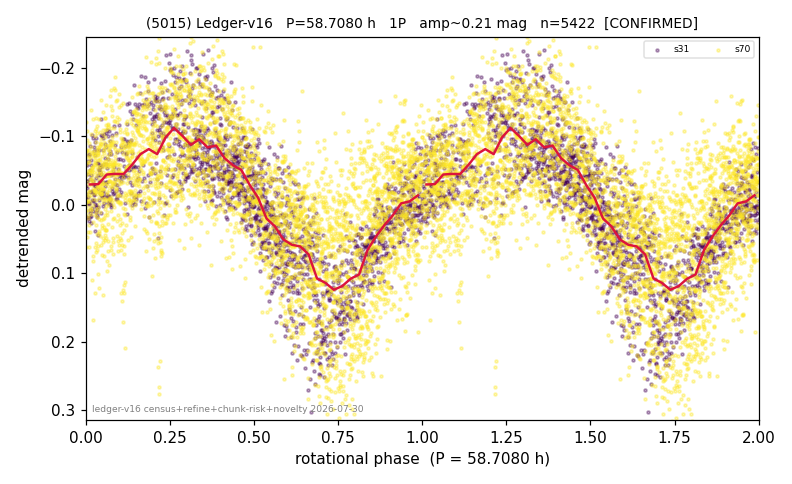

# (5015)

**Adopted:** 58.708 h, 1P, CONFIRMED

<!-- AUTO:START (regenerated from pipeline outputs; do not hand-edit this block) -->
## Evidence (auto)

Detected in 2 sector(s):

| sector | N | baseline (h) | P_phot (h) | power | FAP | cycles | flags |
|--|--|--|--|--|--|--|--|
| s31 | 1762 | 428.5 | 58.6831 | 0.6963 | 0.0e+00 | 7.3 | 2P-ambiguous |
| s70 | 3667 | 213.6 | 58.7334 | 0.4117 | 0.0e+00 | 3.6 | 2P-untestable,2P-ambiguous |

- Pipeline refine said: **1P** (folded amp_fourier 0.244); flags: few-cycle:3.6;gap-alias-risk:85h;sick-dips-excised:s70(1)
- DIA (de-comb): survived(dPW=+13%,R2=0.35,s31@58.708h,2sec)
- Coverage: **2 sector(s)**, best sector covers **7.3 cycles** of the adopted period. Measured periodogram peak width 11% of the period, i.e. about **+/- 2.74 h** (1 sigma); the decimal places in the adopted value are not a precision claim.
- Factor of two: no doubling was applied.
- Gates: FAP<1e-3 and power>=0.10 per detecting sector; >=2 sectors agree (harmonic-aware).
- Adopted shape: **1P** (folded-amplitude rule; pipeline agrees).

### Why this row reads the way it does

- 2 sector(s) detecting
- cross-sector fold correlation 0.82
- single-peaked at folded amp 0.244 mag
- pipeline flag: few-cycle

<!-- AUTO:END -->
