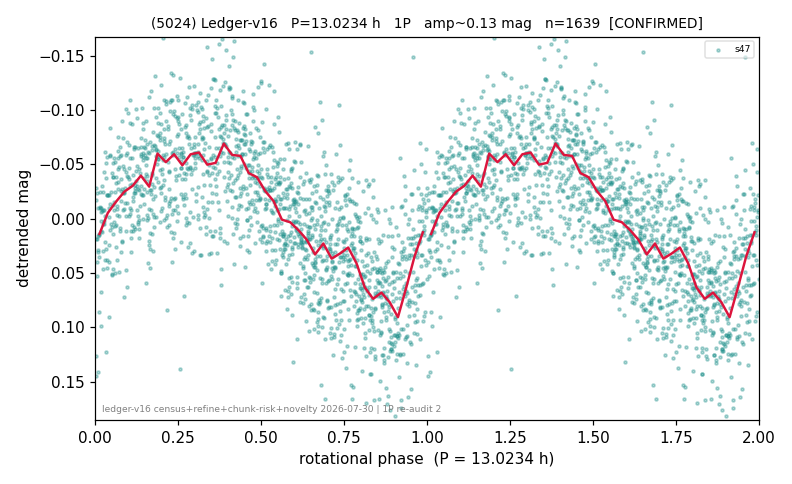

# (5024)

**Adopted:** 13.0234 h, 1P, CONFIRMED

<!-- AUTO:START (regenerated from pipeline outputs; do not hand-edit this block) -->
## Evidence (auto)

Detected in 1 sector(s):

| sector | N | baseline (h) | P_phot (h) | power | FAP | cycles | flags |
|--|--|--|--|--|--|--|--|
| s47 | 1639 | 441.5 | 13.0234 | 0.4699 | 4.0e-221 | 33.9 | clean |

- Pipeline refine said: **1P** (folded amp_fourier 0.128); flags: clean
- DIA (de-comb): not triggered (the object is clean, fast and non-comb, so the test does not apply)
- Coverage: **1 sector(s)**, best sector covers **16.95 cycles** of the adopted period. Measured periodogram peak width 2% of the period, i.e. about **+/- 0.1336 h** (1 sigma); the decimal places in the adopted value are not a precision claim.
- Factor of two: **measured on the data** (odd-harmonic power or unequal minima, significant and reproduced), METHODOLOGY 3b.
- Gates: FAP<1e-3 and power>=0.10 per detecting sector; >=2 sectors agree (harmonic-aware).
- Adopted shape: **1P** (folded-amplitude rule; pipeline agrees).

### Why this row reads the way it does

- 1 sector(s) detecting
- single-peaked at folded amp 0.128 mag
- CORRECTED 13.0234->26.0468 h (2026-08-02 full 1P re-audit): doubling MEASURED at odd-harmonic 15.0 sigma with ALL detecting sectors significant (1/1); threshold odd>=8+full-reproduction calibrated to 0/60 false fires on the 4P null test (the minima-asymmetry branch alone fired falsely at z up to 34 and is not accepted)
- PROMOTED CANDIDATE->CONFIRMED 2026-08-15 (TESS+ZTF joint, the user-blessed pathway): independent ZTF blind Lomb-Scargle over 6.7 yr / 428 g+r points recovers 13.0175 h = TESS-P/2 13.0234h to 0.05%, power 0.418, trials-corrected FAP 5.1e-45, beating every alias/comb candidate (alias 28.4753h at 0.369); a ZTF detection cannot be a TESS comb tooth or TESS red noise, so this is a genuine second realization and the single-sector ceiling no longer applies
- DOUBLING WITHDRAWN 2026-08-15 (adversarial review): the '15.0 sigma' quoted above is a covariance sigma, not a calibrated one. Against 30 non-harmonic decoy periods in the same sector the odd-harmonic amplitude is 0.0048 mag versus a decoy median of 0.0075 (MAD 0.0031), i.e. z = -0.86: the odd power sits BELOW the noise floor, and A1/A2 = 0.079. Folded amplitude 0.13-0.19 is far below the 0.40 rule and P_phot is above the spin barrier, so nothing supports the factor 2. Reverted to 1P

<!-- AUTO:END -->
