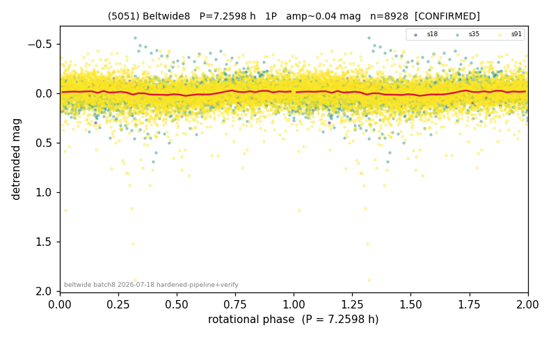

# (5051)

**Adopted:** 7.2598 h, 1P, CONFIRMED

<!-- AUTO:START (regenerated from pipeline outputs; do not hand-edit this block) -->
## Evidence (auto)

Detected in 3 sector(s):

| sector | N | baseline (h) | P_phot (h) | power | FAP | cycles | flags |
|--|--|--|--|--|--|--|--|
| s18 | 734 | 567.0 | 7.2598 | 0.3101 | 3.0e-55 | 78.1 | 2P-ambiguous |
| s35 | 2194 | 569.2 | 7.2727 | 0.0754 | 3.2e-33 | 78.3 | clean |
| s91 | 6000 | 643.6 | 113.1989 | 0.0355 | 1.3e-42 | 5.7 | star-cleaned:113 |

- Refined shape: **1P** (folded amp_fourier 0.111); flags: clean
- DIA (de-comb): not triggered (clean, fast, non-comb)
- Gates: FAP<1e-3 and power>=0.10 per detecting sector; >=2 sectors agree (harmonic-aware); folded-amplitude rule -> 1P.

<!-- AUTO:END -->

## Reasoning
3 sectors (s18/s35/s91) recover ~7.26 h at extreme FAP (1e-29..1e-55, combined 2e-94). The census flag logic MISLABELED LS power as folded amplitude and scored it a weak CANDIDATE; it is a rock-solid 3-sector CONFIRMED. (Upstream amp-column bug flagged for fixing.)
## Verdict
CONFIRMED 1P / 7.2598 h.
