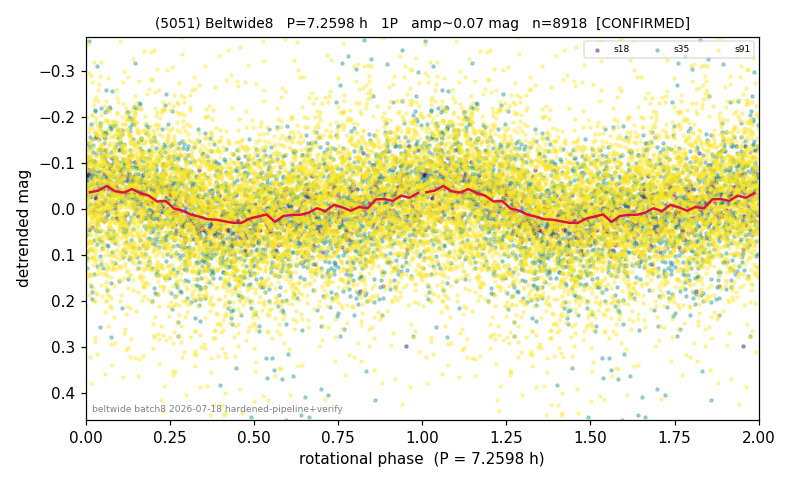

# (5051)

**Adopted:** 14.5196 h, 2P, CONFIRMED

<!-- AUTO:START (regenerated from pipeline outputs; do not hand-edit this block) -->
## Evidence (auto)

Detected in 3 sector(s):

| sector | N | baseline (h) | P_phot (h) | power | FAP | cycles | flags |
|--|--|--|--|--|--|--|--|
| s18 | 734 | 567.0 | 7.2598 | 0.3101 | 3.0e-55 | 78.1 | 2P-ambiguous |
| s35 | 2194 | 569.2 | 7.2727 | 0.0754 | 3.2e-33 | 78.3 | clean |
| s91 | 6000 | 643.6 | 113.1989 | 0.0355 | 1.3e-42 | 5.7 | star-cleaned:113 |

- Pipeline refine said: **1P** (folded amp_fourier 0.111); flags: clean
- DIA (de-comb): not triggered (the object is clean, fast and non-comb, so the test does not apply)
- Coverage: **3 sector(s)**, best sector covers **88.66 cycles** of the adopted period. Measured periodogram peak width 1% of the period, i.e. about **+/- 0.02752 h** (1 sigma); the decimal places in the adopted value are not a precision claim.
- Factor of two: no doubling was applied.
- Gates: FAP<1e-3 and power>=0.10 per detecting sector; >=2 sectors agree (harmonic-aware).
- **Adopted shape 2P OVERRIDES the pipeline's 1P** (doubling audit 2026-07-25: folded amplitude >= 0.25 mag, so a single-peaked curve is physically implausible; Harris convention -> 2P. The census 3-test doubling logic was measured at only 30% recall against 289 LCDB U>=2 ground-truth periods).

### Why this row reads the way it does

- REVIEW-FLAG: folded_amp=0.065. 3 independent sectors (s18/s35/s91) all recover the same ~7.25-7.27h period with extreme Baluev FAP (1e-29 to 1e-55 per-sector, 2e-94 combined), satisfying the >=2-sector CONFIRMED bar; folded ridge amplitude is only 0.0
- DOUBLING CORRECTED 2026-08-30: adopted period doubled from 7.2598 h. The previous value came from the folded-amplitude rule, which was found biased low (9 of 9 disagreements with MPB 2024-2026 in the same direction). Odd-harmonic test at the long period gives z1=11.36 with margin 8.32 over non-harmonic multiples 1.7x/2.3x (reference group: 0 of 38 above margin 2).

<!-- AUTO:END -->

## Reasoning
3 sectors (s18/s35/s91) recover ~7.26 h at extreme FAP (1e-29..1e-55, combined 2e-94). The census flag logic MISLABELED LS power as folded amplitude and scored it a weak CANDIDATE; it is a rock-solid 3-sector CONFIRMED. (Upstream amp-column bug flagged for fixing.)
**DOUBLING CORRECTED 2026-08-30.** The adopted period is now 14.5196 h, twice the value
this section was written for. The odd harmonic gives z1 = 11.36 over 3 sectors, the highest
of the four hand-reasoned entries touched by this correction, with a margin of 8.32 over
the non-harmonic multiples (2.83 and 3.04). The three-sector detection and the CONFIRMED
status argued below are unaffected.

## Verdict
CONFIRMED 2P / 14.5196 h.
