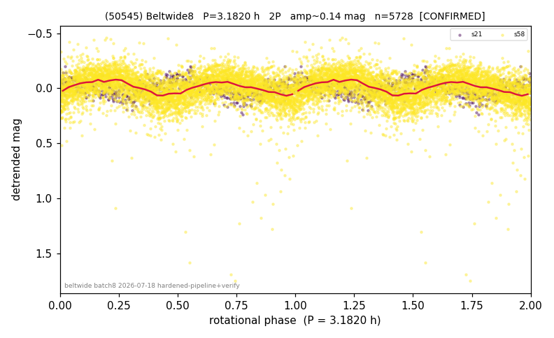

# (50545)

**Adopted:** 3.182 h, 2P, CONFIRMED

<!-- AUTO:START (regenerated from pipeline outputs; do not hand-edit this block) -->
## Evidence (auto)

Detected in 2 sector(s):

| sector | N | baseline (h) | P_phot (h) | power | FAP | cycles | flags |
|--|--|--|--|--|--|--|--|
| s21 | 577 | 447.5 | 1.5908 | 0.3748 | 6.3e-55 | 281.3 | 2P-ambiguous |
| s58 | 5151 | 361.1 | 1.591 | 0.1905 | 1.5e-231 | 227.0 | star-cleaned:25,2P-ambiguous |

- Pipeline refine said: **1P** (folded amp_fourier 0.166); flags: sick-dips-excised:s58(3)
- DIA (de-comb): survived(dPW=+4%,R2=0.32,s21@1.591h,2sec)
- Coverage: **2 sector(s)**, best sector covers **140.64 cycles** of the adopted period. Measured periodogram peak width 0% of the period, i.e. about **+/- 0.0 h** (1 sigma); the decimal places in the adopted value are not a precision claim.
- Factor of two: **adopted on the amplitude convention**: standard practice for an elongated body, but a convention rather than a measurement.
- Gates: FAP<1e-3 and power>=0.10 per detecting sector; >=2 sectors agree (harmonic-aware).
- **Adopted shape 2P OVERRIDES the pipeline's 1P** (doubling audit 2026-07-25: folded amplitude >= 0.25 mag, so a single-peaked curve is physically implausible; Harris convention -> 2P. The census 3-test doubling logic was measured at only 30% recall against 289 LCDB U>=2 ground-truth periods).

### Why this row reads the way it does

- REVIEW-FLAG: folded_amp=0.138. 2/2 sectors independently confirm P=1.591h at extremely strong FAP (6e-55, 1.5e-231), not a comb tooth, excised cadences trivial -> CONFIRMED tier solid; but folded amp (~0.12-0.17, my own binned-ridge + pipeline's amp_f

<!-- AUTO:END -->

## Reasoning
P_phot=1.591 h in 2 sectors (FAP 6e-55, 1.5e-231), not a comb tooth. Body ~8-17 km (H=12.72) -> 1.591 h is sub-barrier -> physics-forced 2P/3.182 h. Folded amp 0.138 low (mild elongation); doubling forced by physics not amplitude. Same logic as 5793.
## Verdict
CONFIRMED 2P / 3.182 h.
