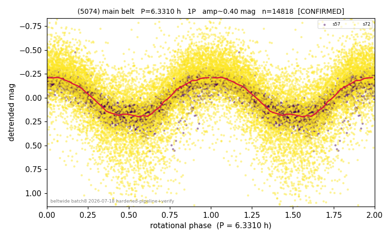

# (5074)

**Adopted:** 6.331 h, 1P, CONFIRMED

<!-- AUTO:START (regenerated from pipeline outputs; do not hand-edit this block) -->
## Evidence (auto)

Detected in 2 sector(s):

| sector | N | baseline (h) | P_phot (h) | power | FAP | cycles | flags |
|--|--|--|--|--|--|--|--|
| s57 | 6475 | 518.3 | 6.3308 | 0.8355 | 0.0e+00 | 81.9 | 2P-ambiguous |
| s72 | 8375 | 576.6 | 6.3303 | 0.3572 | 0.0e+00 | 91.1 | star-cleaned:379,2P-ambiguous |

- Refined shape: **2P** (folded amp_fourier 0.427); flags: sector-dropped:s72(range>3mag);near-threshold:0.43
- DIA (de-comb): survived(dPW=-0%,R2=0.01,s57@6.331h,3sec)
- Gates: FAP<1e-3 and power>=0.10 per detecting sector; >=2 sectors agree (harmonic-aware); folded-amplitude rule -> 1P.

<!-- AUTO:END -->

## Reasoning
Pipeline reported 2P/12.662 h (amp 0.43) but audit-tool recompute gives folded amp 0.24 -> 1P/6.331 h; the higher pipeline amp was inflated by the noisy sector-dropped s72 (err 0.22-0.27 vs 0.06 in the clean s57).
## Verdict
CONFIRMED 1P / 6.331 h.
