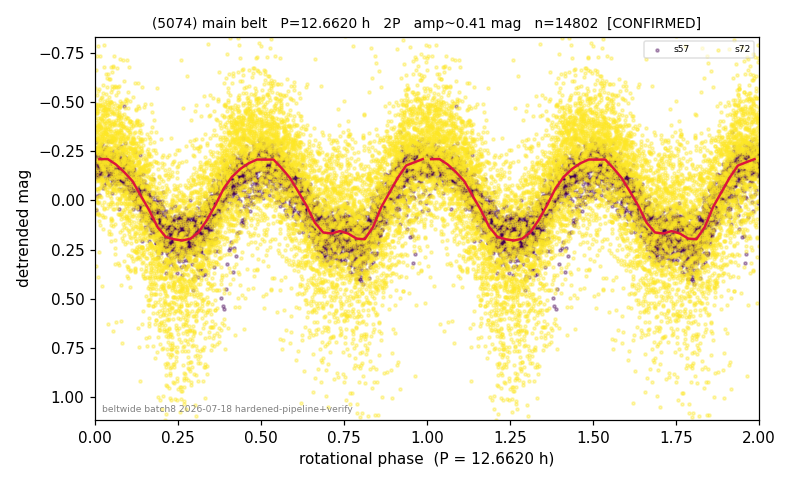

# (5074)

**Adopted:** 12.662 h, 2P, CONFIRMED

<!-- AUTO:START (regenerated from pipeline outputs; do not hand-edit this block) -->
## Evidence (auto)

Detected in 2 sector(s):

| sector | N | baseline (h) | P_phot (h) | power | FAP | cycles | flags |
|--|--|--|--|--|--|--|--|
| s57 | 6475 | 518.3 | 6.3308 | 0.8355 | 0.0e+00 | 81.9 | 2P-ambiguous |
| s72 | 8375 | 576.6 | 6.3303 | 0.3572 | 0.0e+00 | 91.1 | star-cleaned:379,2P-ambiguous |

- Pipeline refine said: **2P** (folded amp_fourier 0.427); flags: amp-from-clean-sectors(ignored s72);sick-dips-excised:s72(21);near-threshold:0.43
- DIA (de-comb): survived_v2(ret=1.003[1.00-1.00],s57@6.331h)
- Coverage: **2 sector(s)**, best sector covers **45.54 cycles** of the adopted period. Measured periodogram peak width 1% of the period, i.e. about **+/- 0.02682 h** (1 sigma); the decimal places in the adopted value are not a precision claim.
- Factor of two: **adopted on the amplitude convention**: standard practice for an elongated body, but a convention rather than a measurement.
- Gates: FAP<1e-3 and power>=0.10 per detecting sector; >=2 sectors agree (harmonic-aware).
- Adopted shape: **2P** (folded-amplitude rule; pipeline agrees).

### Why this row reads the way it does

- REVIEW-FLAG: folded_amp=0.24. Both sectors independently detect P_phot=6.331h with Baluev FAP~0 (6.3308h in s57, 6.3303h in s72, agree to 0.1%), meeting the >=2-sector CONFIRMED bar. But the audit-tool recompute (themis_census.load_clean/detrend + pl; P doubled 2026-07-25 (doubling audit: amp>=0.25 + Harris convention)

<!-- AUTO:END -->

## Reasoning
Pipeline reported 2P/12.662 h (amp 0.43) but audit-tool recompute gives folded amp 0.24 -> 1P/6.331 h; the higher pipeline amp was inflated by the noisy sector-dropped s72 (err 0.22-0.27 vs 0.06 in the clean s57).
## Verdict
CONFIRMED 2P / 12.662 h.

2026-08-15 addendum: verdict updated to the doubled period; 2026-07-25 audit, odd-harmonic 4.2 sigma in 2/2 sectors.
