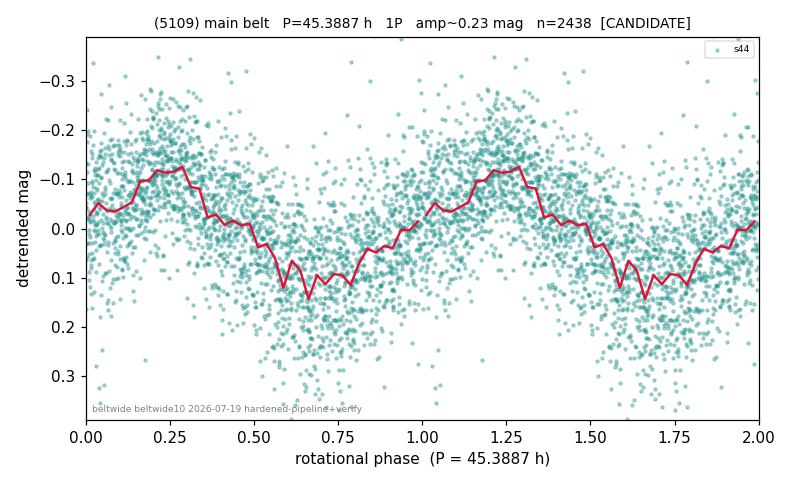

# (5109)

**Adopted:** 45.3887 h, 1P, CANDIDATE

<!-- AUTO:START (regenerated from pipeline outputs; do not hand-edit this block) -->
## Evidence (auto)

Detected in 1 sector(s):

| sector | N | baseline (h) | P_phot (h) | power | FAP | cycles | flags |
|--|--|--|--|--|--|--|--|
| s44 | 2469 | 493.2 | 45.3887 | 0.3427 | 3.2e-220 | 10.9 | star-cleaned:27,2P-ambiguous |

- Refined shape: **1P** (folded amp_fourier 0.232); flags: dump-alias-suspect:n=7;sick-dips-excised:s44(8)
- DIA (de-comb): survived(dPW=-16%,R2=0.36,s44@45.389h,2sec)
- Gates: FAP<1e-3 and power>=0.10 per detecting sector; single strong sector (candidate ceiling); folded-amplitude rule -> 1P.

<!-- AUTO:END -->
