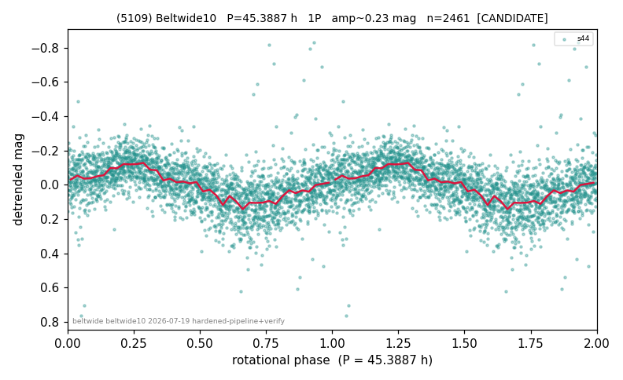

# (5109)

**Adopted:** 45.3887 h, 1P, CANDIDATE

<!-- AUTO:START (regenerated from pipeline outputs; do not hand-edit this block) -->
## Evidence (auto)

Detected in 1 sector(s):

| sector | N | baseline (h) | P_phot (h) | power | FAP | cycles | flags |
|--|--|--|--|--|--|--|--|
| s44 | 2469 | 493.2 | 45.3887 | 0.3427 | 3.2e-220 | 10.9 | star-cleaned:27,2P-ambiguous |

- Pipeline refine said: **1P** (folded amp_fourier 0.232); flags: dump-alias-suspect:n=7;sick-dips-excised:s44(8)
- DIA (de-comb): survived(dPW=-16%,R2=0.36,s44@45.389h,2sec)
- Coverage: **1 sector(s)**, best sector covers **10.87 cycles** of the adopted period. Measured periodogram peak width 7% of the period, i.e. about **+/- 1.437 h** (1 sigma); the decimal places in the adopted value are not a precision claim.
- Factor of two: no doubling was applied.
- Gates: FAP<1e-3 and power>=0.10 per detecting sector; single strong sector (candidate ceiling).
- Adopted shape: **1P** (folded-amplitude rule; pipeline agrees).

### Why this row reads the way it does

- folded_amp=0.27. SINGLE-SECTOR s44 -> CANDIDATE (verify agent verdict-enum said CONFIRMED but its own reasoning applied the single-sector cap; corrected at synthesis). FAP 3e-220, split-half r=0.955 zero-shift; dump-alias n=7 ACTIVELY CLEARED by window test (power 4e-5 at P).

<!-- AUTO:END -->
