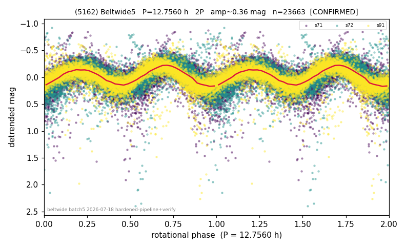

# (5162)

**Adopted:** 12.756 h, 2P, CONFIRMED

<!-- AUTO:START (regenerated from pipeline outputs; do not hand-edit this block) -->
## Evidence (auto)

Detected in 3 sector(s):

| sector | N | baseline (h) | P_phot (h) | power | FAP | cycles | flags |
|--|--|--|--|--|--|--|--|
| s71 | 8232 | 604.9 | 6.3779 | 0.396 | 0.0e+00 | 94.8 | star-cleaned:60,2P-ambiguous |
| s72 | 7656 | 579.5 | 6.3786 | 0.386 | 0.0e+00 | 45.4 | star-cleaned:111 |
| s91 | 7775 | 633.8 | 6.3753 | 0.5701 | 0.0e+00 | 99.4 | star-cleaned:64,2P-ambiguous |

- Refined shape: **2P** (folded amp_fourier 0.426); flags: sector-dropped:s72,s91(range>3mag);sick-dips-excised:s71(9);near-threshold:0.43
- DIA (de-comb): survived(dPW=-0%,R2=0.03,s91@6.378h,6sec)
- Gates: FAP<1e-3 and power>=0.10 per detecting sector; >=2 sectors agree (harmonic-aware); folded-amplitude rule -> 2P.

<!-- AUTO:END -->
