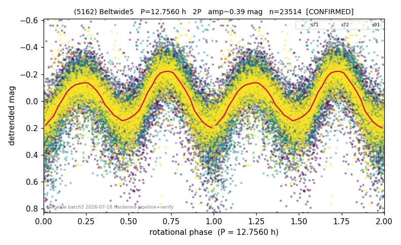

# (5162)

**Adopted:** 12.756 h, 2P, CONFIRMED

<!-- AUTO:START (regenerated from pipeline outputs; do not hand-edit this block) -->
## Evidence (auto)

Detected in 3 sector(s):

| sector | N | baseline (h) | P_phot (h) | power | FAP | cycles | flags |
|--|--|--|--|--|--|--|--|
| s71 | 8232 | 604.9 | 6.3779 | 0.396 | 0.0e+00 | 94.8 | star-cleaned:60,2P-ambiguous |
| s72 | 7656 | 579.5 | 6.3786 | 0.386 | 0.0e+00 | 45.4 | star-cleaned:111 |
| s91 | 7775 | 633.8 | 6.3753 | 0.5701 | 0.0e+00 | 99.4 | star-cleaned:64,2P-ambiguous |

- Pipeline refine said: **2P** (folded amp_fourier 0.438); flags: sick-dips-excised:s71(9),s72(17),s91(41);near-threshold:0.44
- DIA (de-comb): survived(dPW=-0%,R2=0.03,s91@6.378h,6sec)
- Coverage: **3 sector(s)**, best sector covers **49.68 cycles** of the adopted period. Measured periodogram peak width 1% of the period, i.e. about **+/- 0.02 h** (1 sigma); the decimal places in the adopted value are not a precision claim.
- Factor of two: **not stated**, which is a defect in this entry.
- Gates: FAP<1e-3 and power>=0.10 per detecting sector; >=2 sectors agree (harmonic-aware).
- Adopted shape: **2P** (folded-amplitude rule; pipeline agrees).

### Why this row reads the way it does

- 3/3 sectors agree P_phot=6.377-6.378h (LS FAP~0, PDM theta 0.63-0.69 independently confirms), spread<0.1%, 90-99 cycles/sector. Raw amp 0.55-0.72mag;

<!-- AUTO:END -->
