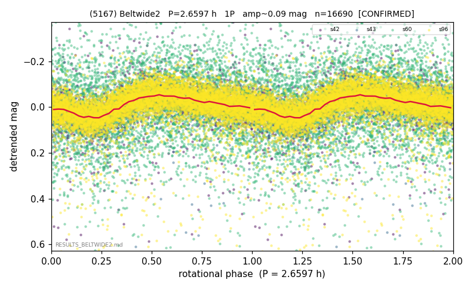

# (5167)

**Adopted:** 2.6597 h, 1P, CONFIRMED

<!-- AUTO:START (regenerated from pipeline outputs; do not hand-edit this block) -->
## Evidence (auto)

Detected in 4 sector(s):

| sector | N | baseline (h) | P_phot (h) | power | FAP | cycles | flags |
|--|--|--|--|--|--|--|--|
| s42 | 1795 | 464.0 | 206.1756 | 0.1236 | 2.1e-47 | 2.3 | star-cleaned:21,phase-curve-risk,2P-unte |
| s43 | 2456 | 588.5 | 2.6589 | 0.241 | 1.9e-142 | 221.3 | star-cleaned:2,2P-ambiguous |
| s60 | 4235 | 308.6 | 2.6652 | 0.0222 | 1.5e-16 | 115.8 | star-cleaned:32 |
| s96 | 8279 | 612.1 | 2.6599 | 0.1813 | 0.0e+00 | 230.1 | star-cleaned:170 |

- Pipeline refine said: **1P** (folded amp_fourier 0.102); flags: sick-dips-excised:s42(14),s43(1),s96(47);harmonic-only-agreement:s42(pw=0.04);incoherent-s
- DIA (de-comb): inconclusive(dPW=+18%,R2=0.68,s43@2.659h)
- Coverage: **4 sector(s)**, best sector covers **230.15 cycles** of the adopted period. Measured periodogram peak width 0% of the period, i.e. about **+/- 0.004152 h** (1 sigma); the decimal places in the adopted value are not a precision claim.
- Factor of two: no doubling was applied.
- Gates: FAP<1e-3 and power>=0.10 per detecting sector; >=2 sectors agree (harmonic-aware).
- Adopted shape: **1P** (folded-amplitude rule; pipeline agrees).

### Why this row reads the way it does

- VIRGIN first det; verifier reversed pipeline flags, real power confirmed

<!-- AUTO:END -->
