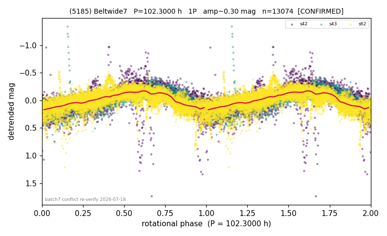

# (5185)

**Adopted:** 102.3 h, 1P, CONFIRMED

<!-- AUTO:START (regenerated from pipeline outputs; do not hand-edit this block) -->
## Evidence (auto)

Detected in 3 sector(s):

| sector | N | baseline (h) | P_phot (h) | power | FAP | cycles | flags |
|--|--|--|--|--|--|--|--|
| s42 | 2786 | 606.2 | 100.4337 | 0.5491 | 0.0e+00 | 3.0 | star-cleaned:6 |
| s43 | 1320 | 360.5 | 102.5685 | 0.5343 | 3.1e-214 | 3.5 | star-cleaned:85,2P-untestable,2P-ambiguo |
| s62 | 8968 | 594.0 | 102.2973 | 0.496 | 0.0e+00 | 5.8 | star-cleaned:1,2P-ambiguous |

- Refined shape: **2P** (folded amp_fourier 0.414); flags: few-cycle:3.0;gap-alias-risk:103h;sick-dips-excised:s42(11),s62(7);near-threshold:0.41
- DIA (de-comb): survived(dPW=+9%,R2=0.07,s62@102.297h,3sec)
- Gates: FAP<1e-3 and power>=0.10 per detecting sector; >=2 sectors agree (harmonic-aware); folded-amplitude rule -> 1P.

<!-- AUTO:END -->

## Reasoning
RECOVERED from a wrong KILL: NOT single-sector (3 sectors s42/s43/s62 agree ~101-102 h, FAP~0). Prior 204.594 h/2P and prior single-sector KILL both wrong; folded amp <0.40 and only 1/3 sectors pass minima test -> 1P/102.3 h.
## Verdict
CONFIRMED 1P / 102.3 h (slow rotator, 3-sector).
