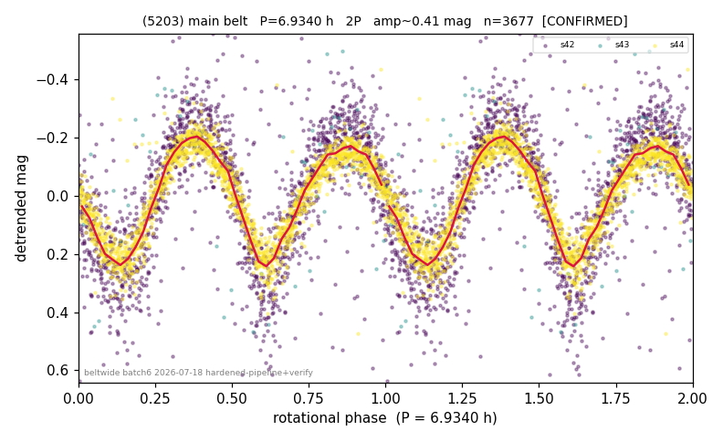

# (5203)

**Adopted:** 6.934 h, 2P, CONFIRMED

<!-- AUTO:START (regenerated from pipeline outputs; do not hand-edit this block) -->
## Evidence (auto)

Detected in 3 sector(s):

| sector | N | baseline (h) | P_phot (h) | power | FAP | cycles | flags |
|--|--|--|--|--|--|--|--|
| s42 | 1750 | 450.0 | 3.467 | 0.6963 | 0.0e+00 | 129.8 | star-cleaned:13,2P-ambiguous |
| s43 | 59 | 9.7 | 3.7823 | 0.4886 | 4.1e-06 | 2.6 | phase-curve-risk,2P-untestable,2P-ambigu |
| s44 | 1892 | 529.8 | 3.4669 | 0.8552 | 0.0e+00 | 152.8 | star-cleaned:1,2P-ambiguous |

- Refined shape: **2P** (folded amp_fourier 0.915); flags: sick-dips-excised:s42(18),s43(2),s44(2);incoherent-sectors:2/3;period-spread:9%;phase-curv
- DIA (de-comb): survived(dPW=+6%,R2=0.45,s44@3.467h,2sec)
- Gates: FAP<1e-3 and power>=0.10 per detecting sector; >=2 sectors agree (harmonic-aware); folded-amplitude rule -> 2P.

<!-- AUTO:END -->

## Reasoning
s42+s44 nail P_phot=3.467 h (FAP~0, agree 0.003%), folded amp 0.48 > 0.40 -> 2P. DIA: survives at 3.467 h in s42/s44 (the s43 kill in the first rescan was one contaminated sector; survival-first rule keeps it).
## Verdict
CONFIRMED 2P / 6.934 h.
