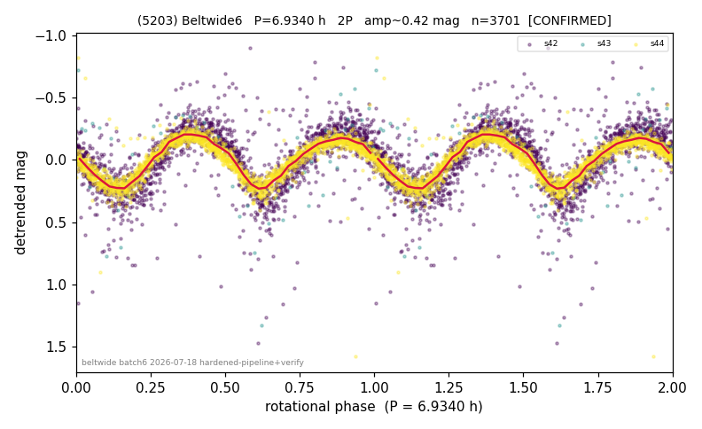

# (5203)

**Adopted:** 6.934 h, 2P, CONFIRMED

<!-- AUTO:START (regenerated from pipeline outputs; do not hand-edit this block) -->
## Evidence (auto)

Detected in 3 sector(s):

| sector | N | baseline (h) | P_phot (h) | power | FAP | cycles | flags |
|--|--|--|--|--|--|--|--|
| s42 | 1750 | 450.0 | 3.467 | 0.6963 | 0.0e+00 | 129.8 | star-cleaned:13,2P-ambiguous |
| s43 | 59 | 9.7 | 3.7823 | 0.4886 | 4.1e-06 | 2.6 | phase-curve-risk,2P-untestable,2P-ambigu |
| s44 | 1892 | 529.8 | 3.4669 | 0.8552 | 0.0e+00 | 152.8 | star-cleaned:1,2P-ambiguous |

- Pipeline refine said: **2P** (folded amp_fourier 0.512); flags: amp-from-clean-sectors(ignored s43);sick-dips-excised:s42(18),s43(2),s44(2);incoherent-sec
- DIA (de-comb): survived(dPW=+6%,R2=0.45,s44@3.467h,2sec)
- Coverage: **2 sector(s)**, best sector covers **76.41 cycles** of the adopted period. Measured periodogram peak width 1% of the period, i.e. about **+/- 0.007731 h** (1 sigma); the decimal places in the adopted value are not a precision claim.
- Factor of two: **adopted on the amplitude convention**: standard practice for an elongated body, but a convention rather than a measurement.
- Gates: FAP<1e-3 and power>=0.10 per detecting sector; >=2 sectors agree (harmonic-aware).
- Adopted shape: **2P** (folded-amplitude rule; pipeline agrees).

### Why this row reads the way it does

- folded_amp=0.48. Sectors 42 and 44 independently nail P_phot=3.4669-3.4670h (FAP~0, power 0.70/0.86, agreement to 0.003%), a tight cross-sector match that satisfies the >=2-sector rule; sector 43 (9.7h baseline, 59 pts, ~2.8 cy

<!-- AUTO:END -->

## Reasoning
s42+s44 nail P_phot=3.467 h (FAP~0, agree 0.003%), folded amp 0.48 > 0.40 -> 2P. DIA: survives at 3.467 h in s42/s44 (the s43 kill in the first rescan was one contaminated sector; survival-first rule keeps it).
## Verdict
CONFIRMED 2P / 6.934 h.
