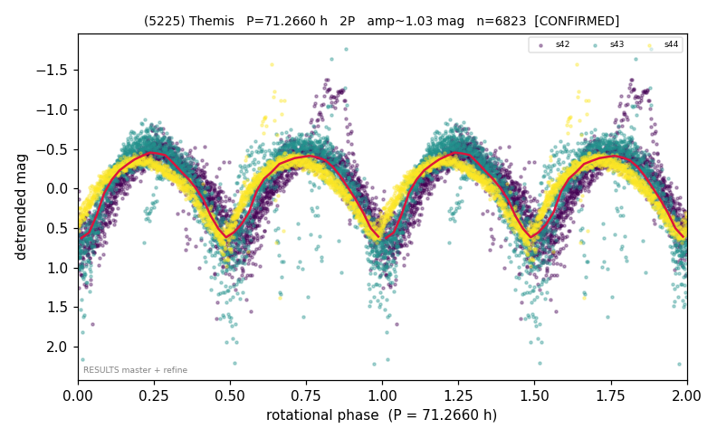

# (5225)

**Adopted:** 71.266 h, 2P, CONFIRMED

<!-- AUTO:START (regenerated from pipeline outputs; do not hand-edit this block) -->
## Evidence (auto)

Detected in 3 sector(s):

| sector | N | baseline (h) | P_phot (h) | power | FAP | cycles | flags |
|--|--|--|--|--|--|--|--|
| s42 | 2589 | 528.2 | 35.6525 | 0.6278 | 0.0e+00 | 14.8 | 2P-ambiguous |
| s43 | 2505 | 502.9 | 35.5749 | 0.7196 | 0.0e+00 | 14.1 | star-cleaned:21,2P-ambiguous |
| s44 | 1729 | 355.2 | 35.6332 | 0.8472 | 0.0e+00 | 10.0 | star-cleaned:13,2P-ambiguous |

- Refined shape: **2P** (folded amp_fourier 0.893); flags: near-comb(amp-cleared):n=9;gap-alias-risk:49h;sector-dropped:s42,s43(range>3mag);sick-dips
- DIA (de-comb): survived(dPW=+1%,R2=0.07,s44@35.633h,5sec)
- Gates: FAP<1e-3 and power>=0.10 per detecting sector; >=2 sectors agree (harmonic-aware); folded-amplitude rule -> 2P.

<!-- AUTO:END -->
