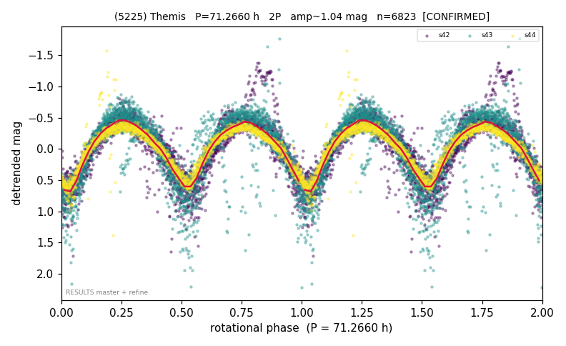

# (5225)

**Adopted:** 71.266 h, 2P, CONFIRMED

<!-- AUTO:START (regenerated from pipeline outputs; do not hand-edit this block) -->
## Evidence (auto)

Detected in 3 sector(s):

| sector | N | baseline (h) | P_phot (h) | power | FAP | cycles | flags |
|--|--|--|--|--|--|--|--|
| s42 | 2589 | 528.2 | 35.6525 | 0.6278 | 0.0e+00 | 14.8 | 2P-ambiguous |
| s43 | 2505 | 502.9 | 35.5749 | 0.7196 | 0.0e+00 | 14.1 | star-cleaned:21,2P-ambiguous |
| s44 | 1729 | 355.2 | 35.6332 | 0.8472 | 0.0e+00 | 10.0 | star-cleaned:13,2P-ambiguous |

- Pipeline refine said: **2P** (folded amp_fourier 1.183); flags: near-comb(amp-cleared):n=9;gap-alias-risk:76h;sick-dips-excised:s42(14),s43(50),s44(3)
- DIA (de-comb): survived_v2(ret=0.983[0.97-1.00],s44@35.633h)
- Coverage: **3 sector(s)**, best sector covers **7.41 cycles** of the adopted period. Measured periodogram peak width 5% of the period, i.e. about **+/- 0.8263 h** (1 sigma); the decimal places in the adopted value are not a precision claim.
- Factor of two: **adopted on the amplitude convention**: standard practice for an elongated body, but a convention rather than a measurement.
- Gates: FAP<1e-3 and power>=0.10 per detecting sector; >=2 sectors agree (harmonic-aware).
- Adopted shape: **2P** (folded-amplitude rule; pipeline agrees).

### Why this row reads the way it does

- amp_F 1.20, a/b~3, shape-inversion target; 3 sectors shape-corr 0.99
- 2P by amplitude rule (folded_amp=1.183)

<!-- AUTO:END -->
