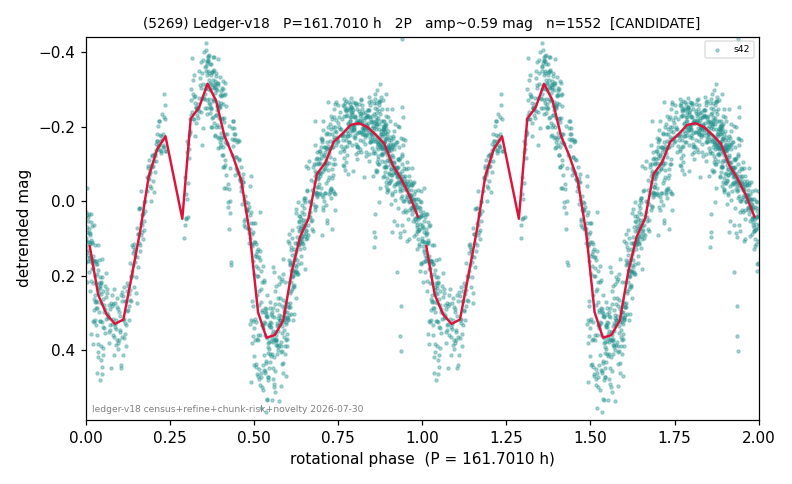

# (5269)

**Adopted:** 161.701 h, 2P, CANDIDATE

<!-- AUTO:START (regenerated from pipeline outputs; do not hand-edit this block) -->
## Evidence (auto)

Detected in 1 sector(s):

| sector | N | baseline (h) | P_phot (h) | power | FAP | cycles | flags |
|--|--|--|--|--|--|--|--|
| s42 | 1552 | 590.4 | 80.8505 | 0.7939 | 0.0e+00 | 7.3 | star-cleaned:4,2P-ambiguous |

- Pipeline refine said: **2P** (folded amp_fourier 0.586); flags: near-comb(amp-cleared):n=2,4;few-cycle:3.7;gap-alias-risk:130h
- DIA (de-comb): survived(dPW=+11%,R2=0.37,s42@80.850h,2sec)
- Coverage: **1 sector(s)**, best sector covers **3.65 cycles** of the adopted period. Measured periodogram peak width 12% of the period, i.e. about **+/- 4.02 h** (1 sigma); the decimal places in the adopted value are not a precision claim.
- Factor of two: **measured on the data** (odd-harmonic power or unequal minima, significant and reproduced), METHODOLOGY 3b.
- Gates: FAP<1e-3 and power>=0.10 per detecting sector; single strong sector (candidate ceiling).
- Adopted shape: **2P** (folded-amplitude rule; pipeline agrees).

### Why this row reads the way it does

- 1 sector(s) detecting
- doubling MEASURED: odd-harmonic 3.57 sigma, single sector
- pipeline flag: few-cycle

<!-- AUTO:END -->
