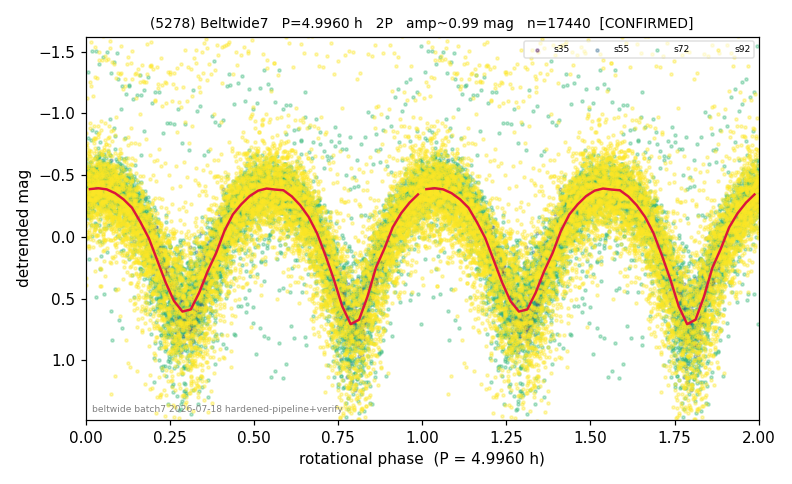

# (5278)

**Adopted:** 4.996 h, 2P, CONFIRMED

<!-- AUTO:START (regenerated from pipeline outputs; do not hand-edit this block) -->
## Evidence (auto)

Detected in 4 sector(s):

| sector | N | baseline (h) | P_phot (h) | power | FAP | cycles | flags |
|--|--|--|--|--|--|--|--|
| s35 | 1826 | 473.2 | 2.4972 | 0.896 | 0.0e+00 | 189.5 | star-cleaned:2,2P-ambiguous |
| s55 | 1702 | 438.0 | 2.4969 | 0.8439 | 0.0e+00 | 175.4 | 2P-ambiguous |
| s72 | 6142 | 581.8 | 2.4985 | 0.6046 | 0.0e+00 | 232.9 | star-cleaned:55,2P-ambiguous |
| s92 | 7892 | 632.5 | 2.4993 | 0.2085 | 0.0e+00 | 253.1 | star-cleaned:51,2P-ambiguous |

- Pipeline refine said: **2P** (folded amp_fourier 1.002); flags: amp-from-clean-sectors(ignored s72);sick-dips-excised:s72(66),s92(54)
- DIA (de-comb): survived(dPW=+0%,R2=0.12,s35@2.498h,8sec)
- Coverage: **4 sector(s)**, best sector covers **126.6 cycles** of the adopted period. Measured periodogram peak width 0% of the period, i.e. about **+/- 0.003899 h** (1 sigma); the decimal places in the adopted value are not a precision claim.
- Factor of two: **adopted on the amplitude convention**: standard practice for an elongated body, but a convention rather than a measurement.
- Gates: FAP<1e-3 and power>=0.10 per detecting sector; >=2 sectors agree (harmonic-aware).
- Adopted shape: **2P** (folded-amplitude rule; pipeline agrees).

### Why this row reads the way it does

- LS finds P=2.497-2.499h all 4 sectors (FAP=0; pow 0.90/0.84/0.61/0.21). Doubled median P_rot=4.996h matches queue. Folded amp 1.0-1.2mag>>0.
- 2P by amplitude rule (folded_amp=1.002)

<!-- AUTO:END -->
