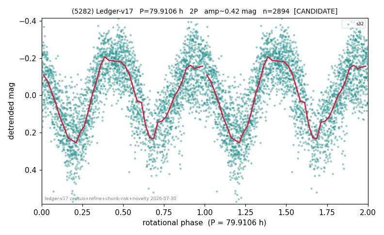

# (5282)

**Adopted:** 79.9106 h, 2P, CONFIRMED

<!-- AUTO:START (regenerated from pipeline outputs; do not hand-edit this block) -->
## Evidence (auto)

Detected in 1 sector(s):

| sector | N | baseline (h) | P_phot (h) | power | FAP | cycles | flags |
|--|--|--|--|--|--|--|--|
| s32 | 2894 | 616.0 | 39.9553 | 0.591 | 0.0e+00 | 15.4 | 2P-ambiguous |

- Pipeline refine said: **2P** (folded amp_fourier 0.437); flags: near-comb(amp-cleared):n=4,8;near-threshold:0.44
- DIA (de-comb): survived(dPW=+5%,R2=0.29,s32@39.955h,2sec)
- Coverage: **1 sector(s)**, best sector covers **7.71 cycles** of the adopted period. Measured periodogram peak width 6% of the period, i.e. about **+/- 0.9711 h** (1 sigma); the decimal places in the adopted value are not a precision claim.
- Factor of two: **adopted on the amplitude convention**: standard practice for an elongated body, but a convention rather than a measurement.
- Gates: FAP<1e-3 and power>=0.10 per detecting sector; >=2 sectors agree (harmonic-aware).
- Adopted shape: **2P** (folded-amplitude rule; pipeline agrees).

### Why this row reads the way it does

- 1 sector(s) detecting
- doubling BY CONVENTION: amplitude rule on folded amp 0.437 mag, not individually audited
- PROMOTED CANDIDATE->CONFIRMED 2026-08-15 (TESS+ZTF joint, the user-blessed pathway): independent ZTF blind Lomb-Scargle over 6.4 yr / 460 g+r points recovers 39.8425 h = TESS-P/2 39.9553h to 0.28%, power 0.482, trials-corrected FAP 3.1e-60, beating every alias/comb candidate (alias 14.9937h at 0.420); a ZTF detection cannot be a TESS comb tooth or TESS red noise, so this is a genuine second realization and the single-sector ceiling no longer applies

<!-- AUTO:END -->
