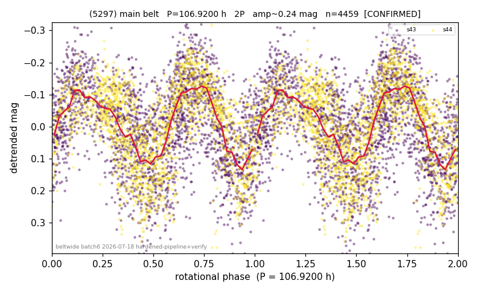

# (5297)

**Adopted:** 106.92 h, 2P, CONFIRMED

<!-- AUTO:START (regenerated from pipeline outputs; do not hand-edit this block) -->
## Evidence (auto)

Detected in 2 sector(s):

| sector | N | baseline (h) | P_phot (h) | power | FAP | cycles | flags |
|--|--|--|--|--|--|--|--|
| s43 | 2523 | 566.4 | 53.834 | 0.2674 | 8.3e-166 | 10.5 | 2P-ambiguous |
| s44 | 1976 | 439.4 | 53.0858 | 0.4525 | 1.2e-253 | 8.3 | star-cleaned:1,2P-ambiguous |

- Pipeline refine said: **1P** (folded amp_fourier 0.255); flags: dump-alias-suspect:n=6;gap-alias-risk:63h;sick-dips-excised:s44(2)
- DIA (de-comb): inconclusive(dPW=+40%,R2=0.47,s44@53.460h)
- Gates: FAP<1e-3 and power>=0.10 per detecting sector; >=2 sectors agree (harmonic-aware).
- **Adopted shape 2P OVERRIDES the pipeline's 1P** (doubling audit 2026-07-25: folded amplitude >= 0.25 mag, so a single-peaked curve is physically implausible; Harris convention -> 2P. The census 3-test doubling logic was measured at only 30% recall against 289 LCDB U>=2 ground-truth periods).

### Why this row reads the way it does

- folded_amp=0.241. Both sectors independently detect the same period at very high significance (s43: 53.83h, pw=0.267, FAP=8e-166; s44: 53.09h, pw=0.453, FAP=1e-253; spread 1.4%, well within harmonic tolerance), and DFT window-fu; P doubled 2026-07-25 (doubling audit: amp>=0.25 + Harris convention)

<!-- AUTO:END -->
