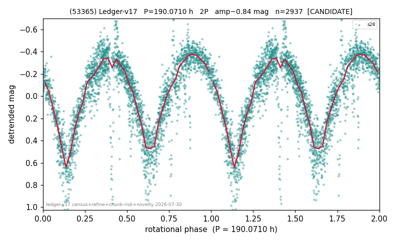

# (53365)

**Adopted:** 190.071 h, 2P, CANDIDATE

<!-- AUTO:START (regenerated from pipeline outputs; do not hand-edit this block) -->
## Evidence (auto)

Detected in 1 sector(s):

| sector | N | baseline (h) | P_phot (h) | power | FAP | cycles | flags |
|--|--|--|--|--|--|--|--|
| s28 | 2942 | 605.7 | 95.0355 | 0.7802 | 0.0e+00 | 6.4 | 2P-ambiguous |

- Pipeline refine said: **2P** (folded amp_fourier 0.824); flags: few-cycle:3.2;sick-dips-excised:s28(5)
- DIA (de-comb): **NOT RUN for this lot.** No de-comb verdict exists for this object, so momentum-dump contamination has not been excluded by that test here.
- Gates: FAP<1e-3 and power>=0.10 per detecting sector; single strong sector (candidate ceiling).
- Adopted shape: **2P** (folded-amplitude rule; pipeline agrees).

### Why this row reads the way it does

- 1 sector(s) detecting
- doubling BY CONVENTION: symmetric fold at 1.00 mag amplitude
- pipeline flag: few-cycle

<!-- AUTO:END -->
