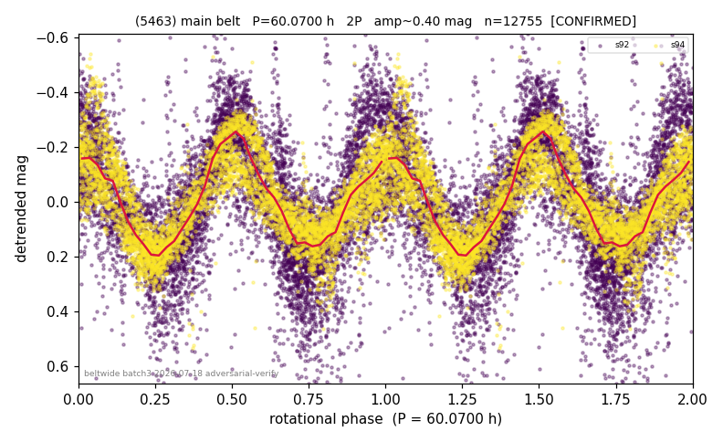

# (5463)

**Adopted:** 60.07 h, 2P, CONFIRMED

<!-- AUTO:START (regenerated from pipeline outputs; do not hand-edit this block) -->
## Evidence (auto)

Detected in 2 sector(s):

| sector | N | baseline (h) | P_phot (h) | power | FAP | cycles | flags |
|--|--|--|--|--|--|--|--|
| s92 | 7835 | 634.0 | 30.0711 | 0.4573 | 0.0e+00 | 21.1 | star-cleaned:185,2P-ambiguous |
| s94 | 5033 | 379.9 | 29.9893 | 0.6744 | 0.0e+00 | 12.7 | star-cleaned:46,2P-ambiguous |

- Refined shape: **2P** (folded amp_fourier 0.453); flags: near-comb(amp-cleared):n=11;sick-dips-excised:s92(47),s94(11)
- DIA (de-comb): survived(dPW=-1%,R2=0.04,s94@30.030h,3sec)
- Gates: FAP<1e-3 and power>=0.10 per detecting sector; >=2 sectors agree (harmonic-aware); folded-amplitude rule -> 2P.

<!-- AUTO:END -->
