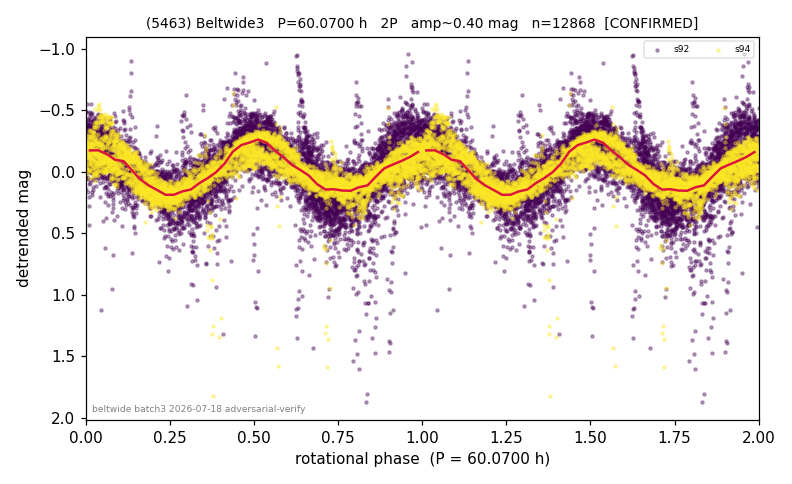

# (5463)

**Adopted:** 60.07 h, 2P, CONFIRMED

<!-- AUTO:START (regenerated from pipeline outputs; do not hand-edit this block) -->
## Evidence (auto)

Detected in 2 sector(s):

| sector | N | baseline (h) | P_phot (h) | power | FAP | cycles | flags |
|--|--|--|--|--|--|--|--|
| s92 | 7835 | 634.0 | 30.0711 | 0.4573 | 0.0e+00 | 21.1 | star-cleaned:185,2P-ambiguous |
| s94 | 5033 | 379.9 | 29.9893 | 0.6744 | 0.0e+00 | 12.7 | star-cleaned:46,2P-ambiguous |

- Pipeline refine said: **2P** (folded amp_fourier 0.453); flags: near-comb(amp-cleared):n=11;sick-dips-excised:s92(47),s94(11)
- DIA (de-comb): survived(dPW=-1%,R2=0.04,s94@30.030h,3sec)
- Coverage: **2 sector(s)**, best sector covers **10.55 cycles** of the adopted period. Measured periodogram peak width 5% of the period, i.e. about **+/- 0.58 h** (1 sigma); the decimal places in the adopted value are not a precision claim.
- Factor of two: **adopted on the amplitude convention**: standard practice for an elongated body, but a convention rather than a measurement.
- Gates: FAP<1e-3 and power>=0.10 per detecting sector; >=2 sectors agree (harmonic-aware).
- Adopted shape: **2P** (folded-amplitude rule; pipeline agrees).

### Why this row reads the way it does

- amp>0.40->2P default 60.07h but 1P/2P AMBIGUOUS (flagged); s92/94 2-method agree; comb 328.8/11 adjacent

<!-- AUTO:END -->
