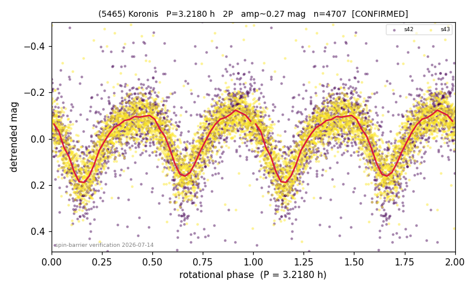

# (5465)

**Adopted:** 3.218 h, 2P, CONFIRMED

<!-- AUTO:START (regenerated from pipeline outputs; do not hand-edit this block) -->
## Evidence (auto)

Detected in 2 sector(s):

| sector | N | baseline (h) | P_phot (h) | power | FAP | cycles | flags |
|--|--|--|--|--|--|--|--|
| s42 | 1987 | 586.4 | 1.6094 | 0.3758 | 1.0e-198 | 364.3 | star-cleaned:47,2P-ambiguous |
| s43 | 2771 | 587.0 | 1.6095 | 0.4913 | 0.0e+00 | 364.7 | star-cleaned:13,2P-ambiguous |

- Pipeline refine said: **1P** (folded amp_fourier 0.287); flags: sick-dips-excised:s42(14),s43(5)
- DIA (de-comb): survived(dPW=+3%,R2=0.05,s43@1.609h,3sec)
- Coverage: **2 sector(s)**, best sector covers **182.41 cycles** of the adopted period. Measured periodogram peak width 0% of the period, i.e. about **+/- 0.002153 h** (1 sigma); the decimal places in the adopted value are not a precision claim.
- Factor of two: PHYSICS.
- Gates: FAP<1e-3 and power>=0.10 per detecting sector; >=2 sectors agree (harmonic-aware).
- **Adopted shape 2P OVERRIDES the pipeline's 1P** (doubling audit 2026-07-25: folded amplitude >= 0.25 mag, so a single-peaked curve is physically implausible; Harris convention -> 2P. The census 3-test doubling logic was measured at only 30% recall against 289 LCDB U>=2 ground-truth periods).

### Why this row reads the way it does

- PHYSICS-FORCED doubling: P_phot 1.609h sub-barrier (rho_crit 5.4 g/cc impossible for rubble pile); 1P monolith NOT established; Szabo-2022 precedent for symmetric-2P adoption
- 2P by spin-barrier physics (P_phot=1.609h sub-barrier, rho_crit 5.4 g/cc impossible for rubble pile)

<!-- AUTO:END -->
