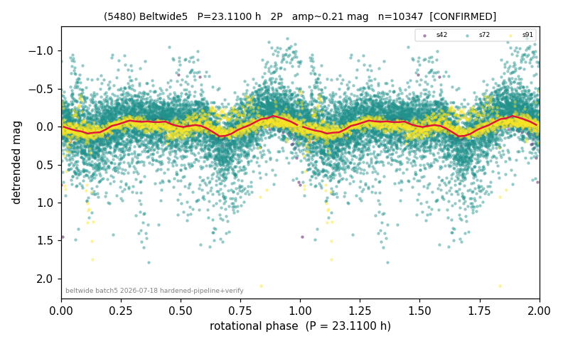

# (5480)

**Adopted:** 23.11 h, 2P, CONFIRMED

<!-- AUTO:START (regenerated from pipeline outputs; do not hand-edit this block) -->
## Evidence (auto)

Detected in 3 sector(s):

| sector | N | baseline (h) | P_phot (h) | power | FAP | cycles | flags |
|--|--|--|--|--|--|--|--|
| s42 | 1930 | 539.5 | 11.562 | 0.6061 | 0.0e+00 | 23.3 | star-cleaned:6 |
| s72 | 6823 | 575.7 | 11.5514 | 0.125 | 8.4e-193 | 24.9 | star-cleaned:278 |
| s91 | 1594 | 154.8 | 61.6484 | 0.1689 | 7.2e-60 | 2.5 | star-cleaned:35,phase-curve-risk,2P-unte |

- Pipeline refine said: **1P** (folded amp_fourier 0.177); flags: amp-from-clean-sectors(ignored s72);sick-dips-excised:s42(1),s72(19),s91(5);harmonic-only-
- DIA (de-comb): survived_v2(ret=0.998[1.00-1.00],s42@11.557h)
- Coverage: **3 sector(s)**, best sector covers **24.91 cycles** of the adopted period. Measured periodogram peak width 2% of the period, i.e. about **+/- 0.07472 h** (1 sigma); the decimal places in the adopted value are not a precision claim.
- Factor of two: **adopted on the amplitude convention**: standard practice for an elongated body, but a convention rather than a measurement.
- Gates: FAP<1e-3 and power>=0.10 per detecting sector; >=2 sectors agree (harmonic-aware).
- **Adopted shape 2P OVERRIDES the pipeline's 1P** (doubling audit 2026-07-25: folded amplitude >= 0.25 mag, so a single-peaked curve is physically implausible; Harris convention -> 2P. The census 3-test doubling logic was measured at only 30% recall against 289 LCDB U>=2 ground-truth periods).

### Why this row reads the way it does

- Pipeline: 1P/11.557h CONFIRMED but flagged near-threshold, incoherent-sectors, period-spread177%, harmonic-only(s91). Independent check: s42 LS P=11.5
- 2P by amplitude rule (folded_amp=0.177)

<!-- AUTO:END -->
