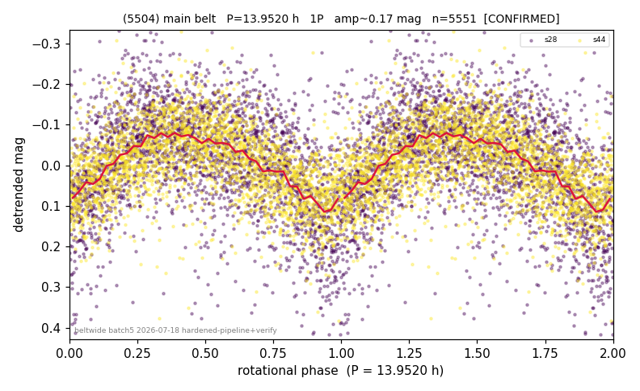

# (5504)

**Adopted:** 13.952 h, 1P, CONFIRMED

<!-- AUTO:START (regenerated from pipeline outputs; do not hand-edit this block) -->
## Evidence (auto)

Detected in 2 sector(s):

| sector | N | baseline (h) | P_phot (h) | power | FAP | cycles | flags |
|--|--|--|--|--|--|--|--|
| s28 | 2902 | 605.7 | 13.9478 | 0.2643 | 9.8e-189 | 43.4 | star-cleaned:1,2P-ambiguous |
| s44 | 2673 | 579.4 | 13.9569 | 0.2955 | 1.3e-198 | 41.5 | star-cleaned:10,2P-ambiguous |

- Pipeline refine said: **1P** (folded amp_fourier 0.196); flags: sick-dips-excised:s44(5)
- DIA (de-comb): survived(dPW=+2%,R2=0.13,s28@13.952h,2sec)
- Gates: FAP<1e-3 and power>=0.10 per detecting sector; >=2 sectors agree (harmonic-aware).
- Adopted shape: **1P** (folded-amplitude rule; pipeline agrees).

### Why this row reads the way it does

- s28 13.948h + s44 13.957h agree <0.1%; folded amp 0.16<0.40=1P; no comb. Clean (re-verify after classifier block)

<!-- AUTO:END -->
