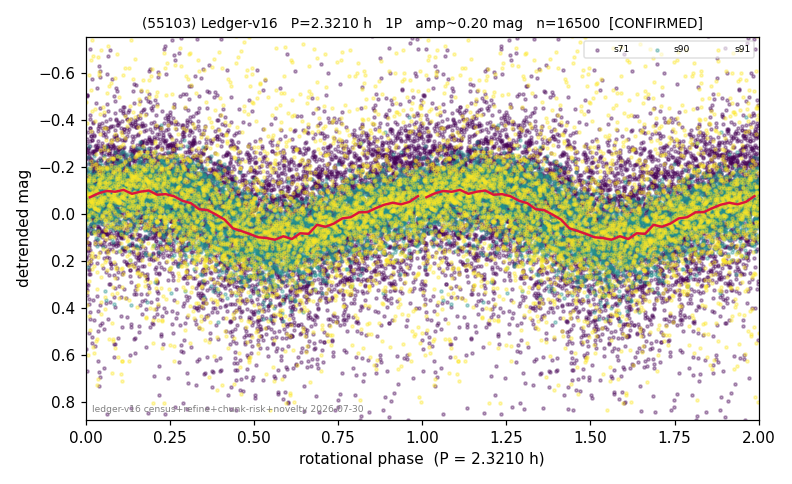

# (55103)

**Adopted:** 2.321 h, 1P, CONFIRMED

<!-- AUTO:START (regenerated from pipeline outputs; do not hand-edit this block) -->
## Evidence (auto)

Detected in 3 sector(s):

| sector | N | baseline (h) | P_phot (h) | power | FAP | cycles | flags |
|--|--|--|--|--|--|--|--|
| s71 | 6891 | 479.9 | 2.3206 | 0.1017 | 1.5e-155 | 206.8 | star-cleaned:114,2P-ambiguous |
| s90 | 6093 | 425.6 | 2.3205 | 0.3721 | 0.0e+00 | 183.4 | 2P-ambiguous |
| s91 | 3623 | 341.0 | 162.8841 | 0.0716 | 3.7e-54 | 2.1 | star-cleaned:71,grid-edge,phase-curve-ri |

- Pipeline refine said: **1P** (folded amp_fourier 0.265); flags: amp-from-clean-sectors(ignored s71);sick-dips-excised:s71(21);harmonic-only-agreement:s71(
- DIA (de-comb): not triggered (clean, fast, non-comb)
- Gates: FAP<1e-3 and power>=0.10 per detecting sector; >=2 sectors agree (harmonic-aware).
- Adopted shape: **1P** (folded-amplitude rule; pipeline agrees).

### Why this row reads the way it does

- 2 sector(s) detecting
- cross-sector fold correlation 0.94
- single-peaked at folded amp 0.265 mag
- pipeline flag: harmonic-only-agreement

<!-- AUTO:END -->
