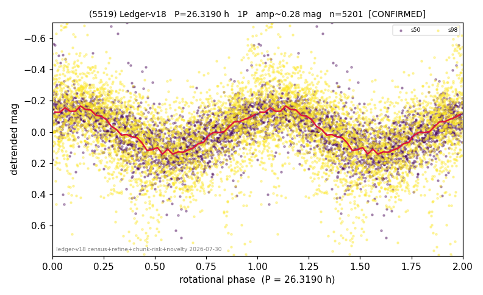

# (5519)

**Adopted:** 26.319 h, 1P, CONFIRMED

<!-- AUTO:START (regenerated from pipeline outputs; do not hand-edit this block) -->
## Evidence (auto)

Detected in 2 sector(s):

| sector | N | baseline (h) | P_phot (h) | power | FAP | cycles | flags |
|--|--|--|--|--|--|--|--|
| s50 | 2031 | 621.7 | 26.4637 | 0.4587 | 8.1e-266 | 23.5 | star-cleaned:30,2P-ambiguous |
| s98 | 3256 | 255.7 | 26.1746 | 0.2519 | 1.7e-200 | 9.8 | star-cleaned:166,2P-ambiguous |

- Pipeline refine said: **1P** (folded amp_fourier 0.337); flags: sick-dips-excised:s50(10),s98(14)
- DIA (de-comb): **NOT RUN for this lot.** No de-comb verdict exists for this object, so momentum-dump contamination has not been excluded by that test here.
- Gates: FAP<1e-3 and power>=0.10 per detecting sector; >=2 sectors agree (harmonic-aware).
- Adopted shape: **1P** (folded-amplitude rule; pipeline agrees).

### Why this row reads the way it does

- 2 sector(s) detecting
- cross-sector fold correlation 0.93
- single-peaked at folded amp 0.337 mag

<!-- AUTO:END -->
