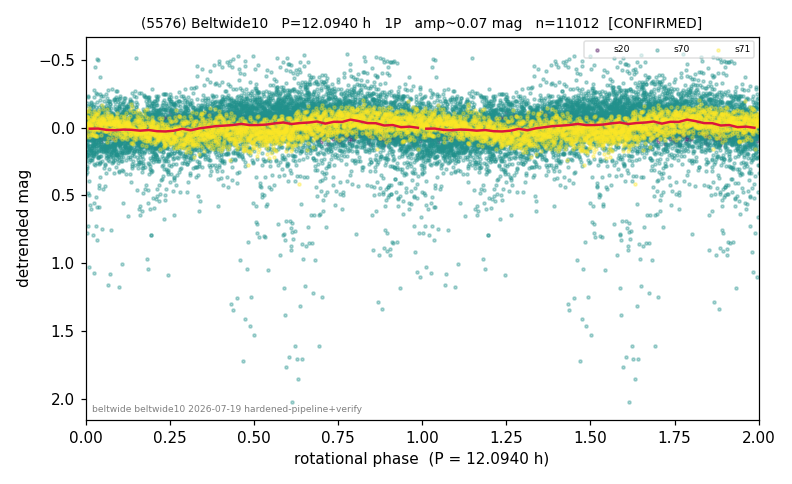

# (5576)

**Adopted:** 12.094 h, 1P, CONFIRMED

<!-- AUTO:START (regenerated from pipeline outputs; do not hand-edit this block) -->
## Evidence (auto)

Detected in 3 sector(s):

| sector | N | baseline (h) | P_phot (h) | power | FAP | cycles | flags |
|--|--|--|--|--|--|--|--|
| s20 | 839 | 630.5 | 12.0396 | 0.6705 | 1.9e-197 | 52.4 | 2P-ambiguous |
| s70 | 7728 | 553.2 | 12.0662 | 0.0791 | 1.9e-133 | 45.8 | star-cleaned:198 |
| s71 | 2445 | 146.3 | 12.1484 | 0.2435 | 1.3e-143 | 12.0 | 2P-ambiguous |

- Refined shape: **1P** (folded amp_fourier 0.141); flags: clean
- DIA (de-comb): not triggered (clean, fast, non-comb)
- Gates: FAP<1e-3 and power>=0.10 per detecting sector; >=2 sectors agree (harmonic-aware); folded-amplitude rule -> 1P.

<!-- AUTO:END -->
